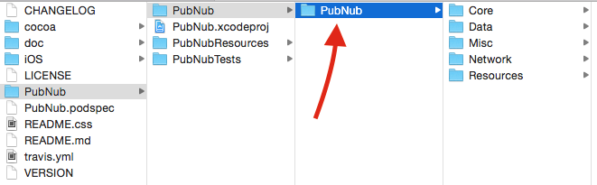
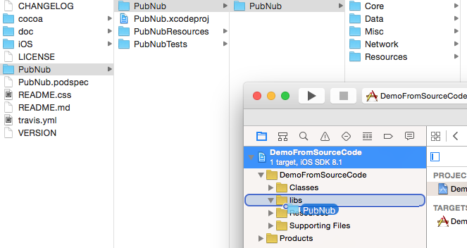
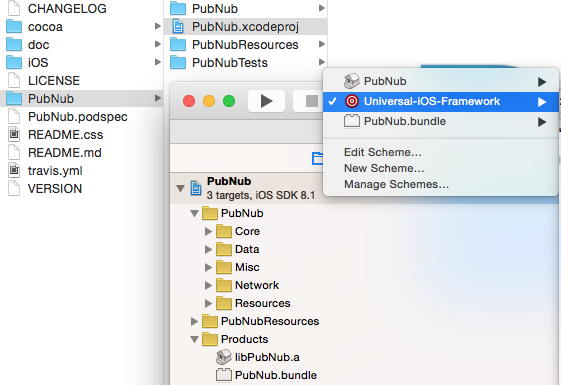
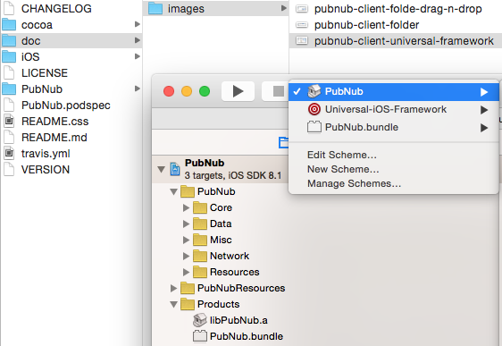
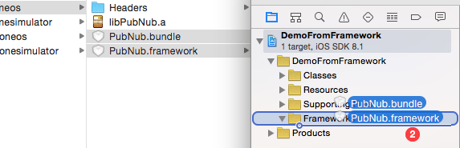
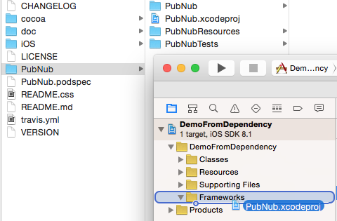
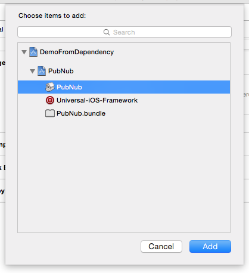
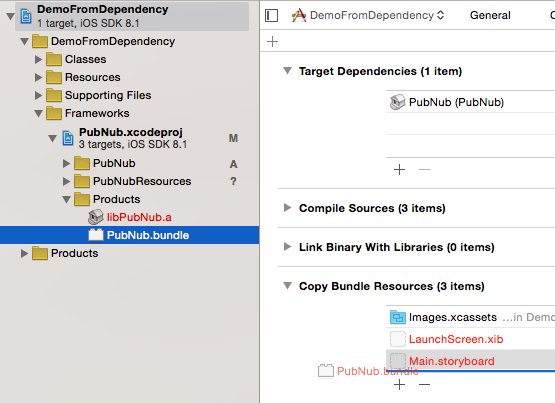

# Please direct all Support Questions and Concerns to Support@PubNub.com

## Beta 4.0 Is Now Available!!
3.x will be sunsetted, and all your new projects should be using the 4.0 client (now in final beta) available at [https://github.com/pubnub/objective-c/tree/4.0b3](https://github.com/pubnub/objective-c/tree/4.0b3)

4.0 is slated to go Production by July 1, 2015.

If you choose to go into production with 4.0 before that time, please contact us at support@pubnub.com first so we can validate your implementation, and be sure you are on the latest and greatest, and that there are no known issues / non-merged fixes you need that would impede your release.

This is Objective-C client (current version **3.7.11**) for the [PubNub.com](http://www.pubnub.com/) real-time messaging network which can be used for iOS 6.1+ and Mac OS 10.6+ projects.  

Table of Contents
=================

- [How to use in project](#use_in_project)
  - [From GitHub](#use_in_project_from_github)
    - [Source code](#use_in_project_from_github_source_code)
    - [Standalone framework](#use_in_project_from_github_standalone_framework)
    - [Dependent project](#use_in_project_from_github_dependent_project)
  - [Using CocoaPods](#use_in_project_using_cocoapods)
  - [Using with Swift](#use_in_swift_based_project)
- [Quick start](#quick_start)
- [Configuration](#configuration)
  - [Client](#client-configuration)
  - [Encryption](#client-encryption-configuration)
  - [APNS](#apns-configuration)
- [Client methods](#client-methods)
  - [Encrypt / Decrypt](#client-encryption)
  - [Determining Connection State](#client-connection-state-check)
  - [Connection / Disconnection](#client-connection)
  - [Subscribe / Unsubscribe](#client-subscribe-unsubscribe)
  - [Presence](#client-presence)
  - [Here Now](#client-here-now)
  - [Where Now](#client-where-now)
  - [Client presence state manipulation](#client-presence-state)
  - [Time](#client-timetoken)
  - [Publish messages](#message-post)
  - [Message history](#message-history)
  - [Stream controller](#stream-controller)
  - [APNS](#apns-methods)
  - [PAM](#pam-methods)
- [Data representation objects](#data-representation-objects)
  - [PNChannel](#pnchannel-object)
  - [PNChannelGroup](#pnchannelgroup-object)
  - [PNChannelGroupNamespace](#pnchannelgroupnamespace-object)
  - [PNMessage](#pnmessage-object)
  - [PNClient](#pnclient-object)
  - [PNHereNow](#pnherenow-object)
  - [PNWhereNow](#pnwherenow-object)
  - [PNPresenceEvent](#pnpresenceevent-object)
  - [PNChannelGroupChange](#pnchannelgroupchange-object)
  - [PNAccessRightOptions](#pnaccessrightoptions-object)
  - [PNAccessRightsCollection](#pnaccessrightscollection-object)
  - [PNAccessRightsInformation](#pnaccessrightsinformation-object)
  - [PNDate](#pndate-object)
- [Error handling](#error-handling)
- [Events handling](#event-handling)
  - [Delegate callbacks](#event-handling-with-delegate)
  - [Block callbacks](#event-handling-with-callback-blocks)
  - [Observation center](#event-handling-with-observatino-center)
  - [Notifications](#event-handling-with-notifications)
- [Logging](#logger)
- [Important Changes](#important-changes)
- [Tests](#tests)

## Beta 4.0 Is Now Available!!
3.x will be sunsetted, and all your new projects should be using the 4.0 client (now in final beta) available at [https://github.com/pubnub/objective-c/tree/4.0b3](https://github.com/pubnub/objective-c/tree/4.0b3)

4.0 is slated to go Production by July 1, 2015.

If you choose to go into production with 4.0 before that time, please contact us at support@pubnub.com first so we can validate your implementation, and be sure you are on the latest and greatest, and that there are no known issues / non-merged fixes you need that would impede your release.

<a name="use_in_project" />
# How to use in project  
Depending on preferred way to control dependencies client code can be added from [GitHub](#use_in_project_from_github) repository or using [CocoaPods](#use_in_project_using_cocoapods).

<a name="use_in_project_from_github" />
## From GitHub repository
First of all you need to get latest version from [GitHub](https://github.com/pubnub/objective-c) as [archive](https://github.com/pubnub/objective-c/archive/master.zip) or clone repository locally:
```bash
git clone git@github.com:pubnub/objective-c.git
```
Depending on preferred dependencies organization approach PubNub client can be added to your project in few ways.  

<a name="use_in_project_from_github_source_code" />
### Source code
PubNub client can be built along with your project from source code. This approach doesn't require PubNub clone persistent presence on your file system after source code has been copied into your project.  
1. Navigate to source code which has been cloned/downloaded from [GitHub](https://github.com/pubnub/objective-c) repository  
2. Navigate to this sub folder  
  
3. Open your project and drag&drop marked folder (from step **#2**) into your project  
  
4. Select "**Copy items if needed**" check-box in presented dialog window (this will copy code from PubNub's repository copy and you can remove this folder if you don't need it anymore).  
5. Link your project against this frameworks and libraries:  
  * SystemConfiguration.Framework  
  * CFNetwork.Framework  
  * CoreWLAN.framework (**only for Mac OS X project**)  
  * libz.dylib  

<a/>6. Import main PubNub client header file into classes where you want to use it or inside of project's `.pch` file (thought it is not required to add it here to be accessible from any part of the project):
```objc
#import "PNImports.h"
```
**NOTE:** Starting from Xcode 6.0 project template doesn't create `.pch` file anymore and you will have to import `PNImports.h` only in classes where you want to use it.  
**NOTE:** If project use Swift as base language then you need to do additional steps described [here](#use_in_swift_based_project).  

<a name="use_in_project_from_github_standalone_framework" />
### Standalone framework
PubNub client project configured to be built as static library or framework using corresponding targets. This approach doesn't require PubNub clone persistent presence on your file system after framework has been built and stored in your project. To build standalone framework you need to:  
1. Open project stored [here](PubNub)  
2. Select corresponding schemes for target platform:  
  * "**Universal-iOS-Framework**" scheme which will allow to build **fat** binary for iOS (will include symbols for both device and simulator).  
    
  * "**PubNub**" scheme which will build static library for Mac OS (and for iOS but only for active architecture) along with framework bundle.  
    

<a/>3. Run "Build" process and wait till it will be completed.  
<a/>4. In project tree expand "**Products**" group and right-click on `libPubNub.a` file entry → Show in Finder  
<a/>5. Select both `PubNub.bundle` (symbols for logger output) and `PubNub.framework` and drag&drop them into your project  
  
<a/>6. Select "**Copy items if needed**" check-box in presented dialog window (this will copy code from PubNub's repository copy and you can remove this folder if you don't need it anymore).  
<a/>7. Link your project against this frameworks and libraries:  
  * SystemConfiguration.Framework  
  * CFNetwork.Framework  
  * CoreWLAN.framework (**only for Mac OS X project**)  
  * libz.dylib  

<a/>8. Select project from project navigator and navigate to "**Build Settings**"  
<a/>9. Search for "**Other Linker Flags**" field and set `-all_load` key there (this will prevent from `unrecognized selector sent to instance` run-time errors)  
<a/>10. Import main PubNub client header file into classes where you want to use it or inside of project's `.pch` file (thought it is not required to add it here to be accessible from any part of the project):  
```objc
#import <PubNub/PNImports.h>
```  
**FYI:** iOS framework binary consist from two different slices (one for device and second one for simulator) which will increase your application's binary size (if you concerned about your application size).  
**NOTE:** Starting from Xcode 6.0 project template doesn't create `.pch` file anymore and you will have to import `<PubNub/PNImports.h>` only in classes where you want to use it.  
**NOTE:** If project use Swift as base language then you need to do additional steps described [here](#use_in_swift_based_project).  

<a name="use_in_project_from_github_dependent_project" />
### Dependant project
Using dependencies, you may ask your project to pre-build another project from which it depends (this will provide required binary data for your project) and complete linkage to generated output along with final compilation. With this approach you will have to keep local copy of PubNub client repository, because your project need reference on project file and all project resources. You can copy [this](PubNub) folder into your project and remove rest of unused PubNub's repository files.  
To configure your project you need to do next:  
1. Open [this](PubNub) folder in finder  
2. Drag&drop `PubNub.xcodeproj` into your project  
  
3. Select project from project navigator and navigate to "**Build Phases**"  
4. Expand "**Target Dependencies**" and hit `+` button  
5. Select "**PubNub**" static library from drop-down list and click "Add" button  
  
6. Expand "**PubNub.xcodeproj**" project Products group in project navigator  
7. Expand "**Copy Bundle Resources**" list  
9. Drag&drop `PubNub.bundle` from "**PubNub.xcodeproj**" project Products group into "**Copy Bundle Resources**" list  
  
10. Switch to "**Build Settings**"  
11. Search for "**Other Linker Flags**" field and set `-all_load` key there (this will prevent from `unrecognized selector sent to instance` run-time errors)  
12. Link your project against this frameworks and libraries:  
  * SystemConfiguration.Framework  
  * CFNetwork.Framework  
  * CoreWLAN.framework (**only for Mac OS X project**)  
  * libz.dylib  
  * libPubNub.a (it will be available under **Workspace** section)  

**NOTE:** Starting from Xcode 6.0 project template doesn't create `.pch` file anymore and you will have to import `<PubNub/PNImports.h>` only in classes where you want to use it.  
**NOTE:** If project use Swift as base language then you need to do additional steps described [here](#use_in_swift_based_project).  

<a name="use_in_project_using_cocoapods" />
## Using CocoaPods
CocoaPods allow to simplify dependency management process by using **Podfile** with your configuration about preferred version of required libraries.  
To use PubNub client via CocoaPods you need to:  
1. Create new project if don't have existing: Xcode → File → New → Project  
2. With _Terminal_ navigate to your project's root directory:  
```bash
cd /Path/to/my/Xcode/Project/
```
<a/>3. Create Podfile (skip this step if already exists):  
```bash
touch Podfile
```
<a/>4. Using your favorite text editor add next line into **Podfile**:  
```bash
pod 'PubNub', '3.7.11'
```
<a/>5. Install dependencies using _Terminal_:  
```bash
pod install
```
<a/>6. After installation completion you will have to use `.xcworkspace` file for further development (CocoaPods integrate into your project using workspace configuration).  
<a/>7. Import main PubNub client header file into classes where you want to use it or inside of project's `.pch` file (thought it is not required to add it here to be accessible from any part of the project):  
```objc
#import "PNImports.h"
```
[These steps are documented in our Emmy-winning CocoaPod's Setup Video, check it out here!](https://vimeo.com/69284108)  
**NOTE:** Starting from Xcode 6.0 project template doesn't create `.pch` file anymore and you will have to import `PNImports.h` only in classes where you want to use it.  
**NOTE:** If project use Swift as base language then you need to do additional steps described [here](#use_in_swift_based_project).  

<a name="use_in_swift_based_project" />
## Using PubNub client in Swift based project
You can used Objective-C classes within Swift based project using special header where will be imported all Objective-C header files which will be used.  
To use Objective-C classes in Swift project you need to do next steps:  
1. Create new file: File → New → File... → Source → Header File (name it for example `BridgingHeader.h`)  
2. Add PubNub Objective-C SDK import in it:  

  * In case if client has been added with CocoaPods (for Swift project) or from GitHub repository as source code:  
  ```objc
#import "PNImports.h"
  ```

  * In case if client has been added as .framework or as dependent project:  
  ```objc
#import <PubNub/PNImports.h>
  ```

<a/>3. Select project file in project navigator and navigate to "**Build Settings**"  
4. Search for "**Objective-C Bridging Header**" field  
5. Specify there path to bridging header created in step **#1** relatively to project file on file system (on same level with _.xcodeproj_ file is folder with name of the project from which path should start).  


<a name="quick_start" />
## Quick start
If you just can't wait to start using PubNub for iOS (we totally know the feeling), after performing the steps from [Adding PubNub to your Project](#use_in_project).  
Choose class where you would like to initiate PubNub client and handle events via delegate callbacks (not required for implementation and completion blocks can be used for operation state change observation). With quick start we will use our application delegate class (_AppDelegate.h[m]_).  
1. Use **private** `AppDelegate` category to place there property which will store reference on our PubNub client instance  
```objc
@property (nonatomic, strong) PubNub *pubNub;
```  
<a/>2. Our `AppDelegate` class will be delegate for our client, so we need to updated private class declaration  
```objc
@interface AppDelegate () <PNDelegate>

@end
```  
<a/>3. Our client will be initialized in `-application:didFinishLaunchingWithOptions:` method  
```objc
- (BOOL)application:(UIApplication *)application 
  didFinishLaunchingWithOptions:(NSDictionary *)launchOptions {
    
    // Using default configuration (values taken from PNDefaultConfiguration.h file) and issue 
    // connect request.
    self.pubNub = [PubNub connectingClientWithConfiguration:[PNConfiguration defaultConfiguration]
                                                delegate:self andSuccessBlock:^(NSString *origin) {
                                                
            NSLog(@"Connected to: %@", origin);
        }
             errorBlock:^(PNError *error) {
                 
                 if (error == nil) {
                     
                     // PubNub client may pass 'nil' here to inform that client can't connect at
                     // this moment because network check not completed (reachability sometime
                     // can be slow).
                     // So here we have a chance to update interface and provide user information
                     // that we will connect a bit later.
                 }
                 else {
                     
                     // Check error.code to find out real reason of error. Always use constants
                     // stored in PNErrorCodes.h for comparison.
                 }
             }];
    // Now self.pubNub stores reference on client instance which is attempting to connect at this 
    // moment.

    // Asking to subscribe on channel with enabled presence observation
    [self.pubNub subscribeOn:@[[PNChannel channelWithName:@"a" shouldObservePresence:YES]]];

    // Sending "hi" message to all subscribers on "a" channel
    [self.pubNub sendMessage:@"hello from PubNub iOS!" toChannel:[PNChannel channelWithName:@"a"]];


    return YES;
}
```  
<a/>4. Handling subscribe completion events  
```objc
- (void)pubnubClient:(PubNub *)client didSubscribeOn:(NSArray *)channelObjects {

    NSLog(@"PubNub client successfully subscribed on channels: %@", channelObjects);
}

// Called in case if client configured to restore connection and subscription after network 
//failure. Mean that client is about to restore subscription on previously subscribed channels.
- (void)pubnubClient:(PubNub *)client willRestoreSubscriptionOn:(NSArray *)channelObjects {

    NSLog(@"PubNub client resuming subscription on: %@", channelObjects);
}

// Called at the end of subscription restore process to notify delegate that subscription has been
// restored on previously active channels.
- (void)pubnubClient:(PubNub *)client didRestoreSubscriptionOn:(NSArray *)channelObjects {

    NSLog(@"PubNub client successfully restored subscription on channels: %@", channelObjects);
}

// Sometimes subscription may fail and we need to handle this situation and check error.code for
// concrete failure reason.
- (void)pubnubClient:(PubNub *)client subscriptionDidFailWithError:(NSError *)error {

    NSLog(@"PubNub client failed to subscribe because of error: %@", error);
}

// Will be called each time when new message arrive to one of channels on which client has been
// subscribed earlier.
- (void)pubnubClient:(PubNub *)client didReceiveMessage:(PNMessage *)message {

    NSLog(@"PubNub client received message: %@", message);
}

// If subscribed on channel with enabled presence observation this delegate will be called each
// time when presence list will be modified or one of subscribers will change his state on channel.
- (void)pubnubClient:(PubNub *)client didReceivePresenceEvent:(PNPresenceEvent *)event {

    NSLog(@"PubNub client received presence event: %@", event);
}
```  
<a/>5. Handling message sending events  
```objc
// Called on delegate when scheduled message sending has been reached in queue and about to send to
// PubNub service.
- (void)pubnubClient:(PubNub *)client willSendMessage:(PNMessage *)message {

    NSLog(@"PubNub client is about to send message: %@", message);
}

// Called each time when message sending has been confirmed by service response (this message may
// appear on other subscribers side earlier then sending confirmation may arrive because PubNub too
// fast)
- (void)pubnubClient:(PubNub *)client didSendMessage:(PNMessage *)message {

    NSLog(@"PubNub client sent message: %@", message);
}

- (void)pubnubClient:(PubNub *)client didFailMessageSend:(PNMessage *)message
           withError:(PNError *)error {

    NSLog(@"PubNub client failed to send message '%@' because of error: %@", message, error);
}
```
This results in a simple application that displays a PubNub 'Ping' message, published every second from PubNub PHP Bot.  
That was just a quick and dirty demo to cut your teeth on... There are other PubNub client demo applications available! These demonstrate in more detail how you can use the delegate and completion block features of the PubNub client.

iOS examples:
  - The [SimpleSubscribe](iOS/HOWTO/SimpleSubscribe) application references how to create a simple subscribe-only, non-UI application using PubNub. [A getting started walk-through document is also available](https://raw.github.com/pubnub/objective-c/master/iOS/HOWTO/SimpleSubscribe/SimpleSubscribeHOWTO_34.pdf).  
  This is the most basic example of how to wire it all up, and as such, should take beginners and experts alike about 5-10 minutes to complete.
  - The [Hello World](iOS/HOWTO/HelloWorld) application references how to create a simple application using PubNub and iOS. [A getting started walk-through document is also available](https://raw.github.com/pubnub/objective-c/master/iOS/HOWTO/HelloWorld/HelloWorld-howto-readme.pdf).
  - The [CallsWithoutBlocks](iOS/HOWTO/CallsWithoutBlocks) application references how to use PubNub more procedurally than asynchronously. If you just want to make calls, without much care for server responses (fire and forget).
  - The [APNSVideo](iOS/HOWTO/APNSVideo) application is the companion to the APNS Tutorial Videos -- [Be sure to checkout the APNS API methods before reviewing this video](#apns-methods).
  - The [Deluxe iPad Full Featured Demo](iOS/iPadDemoApp) iPad-only application demonstrates all API functions in greater detail than the Hello World application. It is intended to be a reference application.

<a name="client-configuration" />
## Configuration
You can test-drive the PubNub client out-of-the-box without additional configuration changes. As you get a feel for it, you can fine tune it's behavior by tweaking the available settings.  
The client is configured via an instance of the [__PNConfiguration__](PubNub/PubNub/PubNub/Data/PNConfiguration.h) class. All default configuration data is stored in [__PNDefaultConfiguration.h__](PubNub/PubNub/PubNub/Misc/PNDefaultConfiguration.h) under appropriate keys.  
Data from [__PNDefaultConfiguration.h__](PubNub/PubNub/PubNub/Misc/PNDefaultConfiguration.h) override any settings not explicitly set during initialization. When PubNub client added to the project as framework or as dependency project, you should use `PNDefaultConfiguration` class methods to complete configuration.  

You can use few class methods to initialize and update instance properties:  
1. Retrieve reference on default client configuration (all values taken from [__PNDefaultConfiguration.h__](PubNub/PubNub/PubNub/Misc/PNDefaultConfiguration.h))  
```objc
+ (PNConfiguration *)defaultConfiguration;  
```
<a/>2. Retrieve the reference on the configuration instance via these methods:  
```objc
+ (PNConfiguration *)configurationWithPublishKey:(NSString *)publishKey subscribeKey:(NSString *)subscribeKey  
                                       secretKey:(NSString *)secretKey;
+ (PNConfiguration *)configurationWithPublishKey:(NSString *)publishKey subscribeKey:(NSString *)subscribeKey  
                                       secretKey:(NSString *)secretKey authorizationKey:(NSString *)authorizationKey;  

+ (PNConfiguration *)configurationForOrigin:(NSString *)originHostName publishKey:(NSString *)publishKey
                               subscribeKey:(NSString *)subscribeKey secretKey:(NSString *)secretKey;
+ (PNConfiguration *)configurationForOrigin:(NSString *)originHostName publishKey:(NSString *)publishKey
                               subscribeKey:(NSString *)subscribeKey secretKey:(NSString *)secretKey
                           authorizationKey:(NSString *)authorizationKey;

+ (PNConfiguration *)configurationForOrigin:(NSString *)originHostName publishKey:(NSString *)publishKey  
                               subscribeKey:(NSString *)subscribeKey secretKey:(NSString *)secretKey  
                                  cipherKey:(NSString *)cipherKey;  // To initialize with encryption, use cipherKey
+ (PNConfiguration *)configurationForOrigin:(NSString *)originHostName publishKey:(NSString *)publishKey  
                               subscribeKey:(NSString *)subscribeKey secretKey:(NSString *)secretKey  
                                  cipherKey:(NSString *)cipherKey  // To initialize with encryption, use cipherKey
                           authorizationKey:(NSString *)authorizationKey;
```
<a/>3. Update the configuration instance using this next set of parameters:  

  - Maximum subscription channels idle time. Used by internal timers to ensure subscription streams still responsible. Before changing this property please contact support@pubnub.com
  ```objc
  subscriptionMaximumIdleTime  
  ```
  __Default:__ 310 seconds (_kPNConnectionIdleTimeout_ key in [__PNDefaultConfiguration.h__](PubNub/PubNub/PubNub/Misc/PNDefaultConfiguration.h))

  - Timeout after which the library will report any ***non-subscription-related*** request (here now, leave, message history, message post, time token) or execution failure.
  ```objc
  nonSubscriptionRequestTimeout  
  ```
  __Default:__ 15 seconds (_kPNNonSubscriptionRequestTimeout_ key in [__PNDefaultConfiguration.h__](PubNub/PubNub/PubNub/Misc/PNDefaultConfiguration.h))
  
  - Timeout after which the library will report ***subscription-related*** request (subscribe on channel(s)) execution failure.  
  The default configuration value is stored inside [__PNDefaultConfiguration.h__](PubNub/PubNub/PubNub/Misc/PNDefaultConfiguration.h) under __kPNSubscriptionRequestTimeout__ key.
  ```objc
  subscriptionRequestTimeout  
  ```
  __Default:__ 10 seconds (_kPNSubscriptionRequestTimeout_ key in [__PNDefaultConfiguration.h__](PubNub/PubNub/PubNub/Misc/PNDefaultConfiguration.h))  
  ***Please consult with PubNub support before setting this value lower than the default to avoid incurring additional charges.***
    
  - Client will pass this value during subscription to inform it after which period of inactivity (when client will stop send ping to the server) it should mark client and __timed out__.
  ```objc
  presenceHeartbeatTimeout
  ```
  __Default:__ 0 seconds (_kPNPresenceHeartbeatTimeout_ key in [__PNDefaultConfiguration.h__](PubNub/PubNub/PubNub/Misc/PNDefaultConfiguration.h)) which will force server to use it's own timeout value.
    
  - Used by client as heartbeat requests rate (interval for scheduling next request). This value should be less then **300** seconds and less then **presenceExpirationTimeout** value, or it will be automatically adjusted.
  ```objc
  presenceHeartbeatInterval
  ```
  __Default:__ 0 seconds (_kPNPresenceHeartbeatInterval_ key in [__PNDefaultConfiguration.h__](PubNub/PubNub/PubNub/Misc/PNDefaultConfiguration.h)) but it will be adjusted as soon as **presenceExpirationTimeout** will be changed.

  - After experiencing network connectivity loss, if network access is restored, should the client reconnect to PubNub, or stay disconnected?
  ```objc
  (getter = shouldAutoReconnectClient) autoReconnectClient  
  ```
  __Default:__ YES (_kPNShouldAutoReconnectClient_ key in [__PNDefaultConfiguration.h__](PubNub/PubNub/PubNub/Misc/PNDefaultConfiguration.h))  
  This can also be controlled via returning __@(YES)__ or __@(NO)__ via the __shouldReconnectPubNubClient:__ delegate.
    
  - Used by client when you change list of channels on which client subscribed at this moment (subscribe, unsubscribe). If property is set to **YES** then client will catchup on messages which may arrive to the "old" channels while change took place. If set to **NO**, client will ignore all messages which may arrive during change process.
  ```objc
  (getter = shouldKeepTimeTokenOnChannelsListChange) keepTimeTokenOnChannelsListChange  
  ```
  __Default:__ YES (kPNShouldKeepTimeTokenOnChannelsListChange key in [__PNDefaultConfiguration.h__](PubNub/PubNub/PubNub/Misc/PNDefaultConfiguration.h))  
  This can also be controlled via returning __@(YES)__ or __@(NO)__ via the __shouldKeepTimeTokenOnChannelsListChange__ delegate.
    
  - If autoReconnectClient == YES, after experiencing network connectivity loss and subsequent reconnect, should the client resume (aka  "catchup") to where it left off before the disconnect?
  ```objc
  (getter = shouldResubscribeOnConnectionRestore) resubscribeOnConnectionRestore
  ```
  __Default:__ YES (_kPNShouldResubscribeOnConnectionRestore_ key in [__PNDefaultConfiguration.h__](PubNub/PubNub/PubNub/Misc/PNDefaultConfiguration.h))  
  This can also be controlled via returning __@(YES)__ or __@(NO)__ via the __shouldResubscribeOnConnectionRestore__ delegate.
    
  - Upon connection restore, should the PubNub client "catch-up" to where it left off upon reconnecting?
  ```objc
  (getter = shouldRestoreSubscriptionFromLastTimeToken) restoreSubscriptionFromLastTimeToken
  ```
  __Default:__ YES (_kPNShouldRestoreSubscriptionFromLastTimeToken key in [__PNDefaultConfiguration.h__](PubNub/PubNub/PubNub/Misc/PNDefaultConfiguration.h))  
  This can also be controlled via returning __@(YES)__ or __@(NO)__ via the __shouldRestoreSubscriptionFromLastTimeToken__ delegate.

  - Should the PubNub client establish the connection to PubNub using SSL?
  ```objc
  (getter = shouldUseSecureConnection) useSecureConnection  
  ```
  __Default:__ YES (_kPNSecureConnectionRequired__ key in [__PNDefaultConfiguration.h__](PubNub/PubNub/PubNub/Misc/PNDefaultConfiguration.h))
    
  - When SSL is enabled, should PubNub client ignore all SSL certificate-handshake issues and still continue in SSL mode if it experiences issues handshaking across local proxies, firewalls, etc?
  ```objc
  (getter = shouldReduceSecurityLevelOnError) reduceSecurityLevelOnError
  ```
  __Default:__ YES (_kPNShouldReduceSecurityLevelOnError_ key in [__PNDefaultConfiguration.h__](PubNub/PubNub/PubNub/Misc/PNDefaultConfiguration.h))
    
  - When SSL is enabled, should the client fallback to a non-SSL connection if it experiences issues handshaking across local proxies, firewalls, etc?
  ```objc
  (getter = canIgnoreSecureConnectionRequirement) ignoreSecureConnectionRequirement
  ```
  __Default:__ YES (_kPNCanIgnoreSecureConnectionRequirement_ key in [__PNDefaultConfiguration.h__](PubNub/PubNub/PubNub/Misc/PNDefaultConfiguration.h))
    
  - To reduce incoming traffic client can be configured to accept compressed responses from server and this property specify on whether it should do so or not?  
  ```objc
  (getter = shouldAcceptCompressedResponse) acceptCompressedResponse
  ```
  __Default:__ YES (_kPNShouldAcceptCompressedResponse_ key in [__PNDefaultConfiguration.h__](PubNub/PubNub/PubNub/Misc/PNDefaultConfiguration.h))

  - When this value is set client will enable encryption on published and received messages.
  ```objc
  cipherKey
  ```
  __Default:__ nil (_kPNCipherKey_ key in [__PNDefaultConfiguration.h__](PubNub/PubNub/PubNub/Misc/PNDefaultConfiguration.h))

  - If client should work with PAM it should be configured with appropriate authorization key which will be used by PAM for access management.
  ```objc
  authorizationKey
  ```
  __Default:__ nil (_kPNAuthorizationKey_ key in [__PNDefaultConfiguration.h__](PubNub/PubNub/PubNub/Misc/PNDefaultConfiguration.h))  
  
**NOTE:** If you are using the `+defaultConfiguration` method to create your configuration instance, then you will need to update:  _kPNPublishKey_, _kPNSubscriptionKey_ and _kPNOriginHost_ keys in [__PNDefaultConfiguration.h__](PubNub/PubNub/PubNub/Misc/PNDefaultConfiguration.h).  

<a name="client-configuration" />
### Client configuration
PubNub client configuration is then set via:
```objc
[pubNub setConfiguration:[PNConfiguration defaultConfiguration]];  
```
After this call, your PubNub client will be configured with the default values taken from [__PNDefaultConfiguration.h__](PubNub/PubNub/PubNub/Misc/PNDefaultConfiguration.h) and is now ready to connect to the PubNub real-time network!  
Other methods which allow you to adjust the client configuration are:  
```objc
+ (PubNub *)clientWithConfiguration:(PNConfiguration *)configuration;
+ (PubNub *)clientWithConfiguration:(PNConfiguration *)configuration 
                        andDelegate:(id<PNDelegate>)delegate;

+ (PubNub *)connectingClientWithConfiguration:(PNConfiguration *)configuration;
+ (PubNub *)connectingClientWithConfiguration:(PNConfiguration *)configuration
                              andSuccessBlock:(PNClientConnectionSuccessBlock)success
                                   errorBlock:(PNClientConnectionFailureBlock)failure;
+ (PubNub *)connectingClientWithConfiguration:(PNConfiguration *)configuration
                                  andDelegate:(id<PNDelegate>)delegate;
+ (PubNub *)connectingClientWithConfiguration:(PNConfiguration *)configuration 
                                     delegate:(id<PNDelegate>)delegate
                              andSuccessBlock:(PNClientConnectionSuccessBlock)success
                                   errorBlock:(PNClientConnectionFailureBlock)failure;

- (void)setConfiguration:(PNConfiguration *)configuration;  
- (void)setupWithConfiguration:(PNConfiguration *)configuration 
                   andDelegate:(id<PNDelegate>)delegate;  
- (void)setDelegate:(id<PNDelegate>)delegate;
- (void)setClientIdentifier:(NSString *)identifier; // Change UUID
- (void)setClientIdentifier:(NSString *)identifier  // Change UUID with catchup options
              shouldCatchup:(BOOL)shouldCatchup;  
```
First two groups of methods allow to create PubNub client instance using different set of configuration options. Second group of methods allow to retrieve reference on configured PubNub instance with initiated connection process.  

`-setConfiguration:` and `-setupWithConfiguration:andDelegate:` methods from list above (which update client configuration) may require client reconnection (if client already connected). As soon as all connections will be closed client will reconnect with updated configuration. It is strongly advised change configuration in really rare cases and most of the time provide configuration during PubNub client configuration. Configuration update on connected client will cause additional overhead to reinitialize client with new configuration and connect back to server (time overhead).  

Changing the UUID mid-connection requires a "__soft state reset__".  A "__soft state reset__" is when the client sends an explicit `leave` request on any subscribed channels, and then resubscribes with its new UUID.  

**NOTE:** If you wish to change the client identifier, then catchup in time where you left-off before you changed client identifier, use:
```objc
[pubNub setClientIdentifier:@"moonlight" shouldCatchup:YES];
```     
To access the client configuration and identifier, the following methods are provided:  
```objc
- (PNConfiguration *)configuration;
- (NSString *)clientIdentifier;  
```
First method from list above allow to retrieve reference on configuration which is currently used by client. It will return copy of [__PNConfiguration__](PubNub/PubNub/PubNub/Data/PNConfiguration.h) instance and any changes in it won't take any effect till it explicitly will be set to the client (`-setConfiguration:` or `-setupWithConfiguration:andDelegate:`)

<a name="client-encryption-configuration" />
### Encryption configuration
This client supports the PubNub AES Encryption standard, which enables this client to speak with all other PubNub iPadDemoApp+ clients securely via AES.  
When encryption is enabled, non-encrypted messages, or messages encrypted with the wrong key will be passed through as the string "**DECRYPTION_ERROR**".  
To initialize with encryption enabled:  
```objc
+ (PNConfiguration *)configurationForOrigin:(NSString *)originHostName publishKey:(NSString *)publishKey  
                               subscribeKey:(NSString *)subscribeKey secretKey:(NSString *)secretKey  
                                  cipherKey:(NSString *)cipherKey;  // To initialize with encryption, use cipherKey
+ (PNConfiguration *)configurationForOrigin:(NSString *)originHostName publishKey:(NSString *)publishKey  
                               subscribeKey:(NSString *)subscribeKey secretKey:(NSString *)secretKey  
                                  cipherKey:(NSString *)cipherKey  // To initialize with encryption, use cipherKey
                           authorizationKey:(NSString *)authorizationKey;
```
To dynamically change the encryption key during runtime, you can run 
```objc
myConfiguration.cipherKey = @"myCipherKey”;
[self.pubNub setConfiguration:myConfiguration];
```
To enable backwards compatibility with PubNub iOS 3.3, add this line to your `.pch`:  
```objc
#define CRYPTO_BACKWARD_COMPATIBILITY_MODE 1
```
The above directive will allow this current PubNub iOS client to speak **ONLY** with earlier PubNub iOS 3.3 clients.  
It is advised for security and network/battery/power considerations to upgrade all clients to iPadDemoApp+ encryption as soon as possible, and to only use this backward compatibility mode if absolutely necessary.  

<a name="apns-configuration" />
### APNS setup
If you've enabled your keys for APNS, you can use native PubNub publish operations to send messages to iPhones and iPads via iOS push notifications!  

#### APNS Video Walk-through

We've just added a video walk-through, along with a sample application (based on the video) that shows from start to end how to setup APNS with PubNub. It includes all Apple-specific setup (which appears to be the most misunderstood) as well as the PubNub-specific setup, along with the end product app available in [HOWTO/APNSVideo](iOS/HOWTO/APNSVideo).

##### APNS Video HOWTO

1. [Review the APNS Methods API](#apns-methods)
2. [Creating the App ID and PEM Cert File](https://vimeo.com/67419903)
An easy way to generate the cert/keypair [can be found here](http://code.google.com/p/apns-php/wiki/CertificateCreation#Generate_a_Push_Certificate)  
Verify your cert was created correctly by running this command (replace with your key/cert name):
  ```bash
openssl s_client -connect gateway.sandbox.push.apple.com:2195 -cert server_certificates_bundle_sandbox.pem -key server_certificates_bundle_sandbox.pem
  ```  
  Then, watch the following in order:
2. [Create the Provisioning Profile](https://vimeo.com/67420404)  
3. [Create and Configure PubNub Account for APNS](https://vimeo.com/67420596)  
4. [Create empty PubNub App Template](https://vimeo.com/67420599)  
5. [Configure for PNDelegate Protocol and create didReceiveMessage delegate method](https://vimeo.com/67420597)  
6. [Set keys, channel, connect, and subscribe and Test Run](https://vimeo.com/67420598)  
7. [Enable and Test for correct APNS configuration (Apple Config)](https://vimeo.com/67423576)  
8. [Provision PubNub APNS](https://vimeo.com/67423577)  

Two files referenced from the video, [generateAPNSPemKey.sh](iOS/generateAPNSPemKey.sh) and [verifyCertWithApple.sh](iOS/verifyCertWithApple.sh) are also available.  
Final product is available here: [HOWTO/APNSVideo](iOS/HOWTO/APNSVideo)

<a name="client-methods" />
## PubNub client methods
PubNub client provide one point access to all available API using `PubNub` client instance. All API separated by context in separate groups.

<a name="client-encryption" />
### Encrypt / Decrypt Methods
If you wish to manually utilize the encryption logic for your own purposes (decrypt messages sent via PubNub from APNS for example), the following public methods can be used:  
```objc
/**
 Cryptographic function which allow to decrypt AES hash stored inside 'base64' string and return
 object.
 */
- (id)AESDecrypt:(id)object;
- (id)AESDecrypt:(id)object error:(PNError **)decryptionError;

/**
 Cryptographic function which allow to encrypt object into 'base64' string using AES and return
 hash string.
 */
- (NSString *)AESEncrypt:(id)object;
- (NSString *)AESEncrypt:(id)object error:(PNError **)encryptionError;
```
<a name="client-connection-state-check" />
### Determining Connection State
You can easily determine the current PubNub connection state via:  
```objc
[pubNub.observationCenter addClientConnectionStateObserver:self
                                         withCallbackBlock:^(NSString *origin, BOOL connected, 
                                                             PNError *error) {
  if (connectionError) {

    // Handle connection error which occurred during connection or while client was connected. 
    // Error also can be sent by PubNub client if you tried to connect while already connected or 
    // just launched connection.
    //
    // Always check error.code to find out what caused error (check PNErrorCodes header file and 
    // use -localizedDescription / -localizedFailureReason and -localizedRecoverySuggestion to get
    // human readable description for error).
  }
  else if (!isConnected) {

    if (error == nil) {

      // Looks like there is no Internet connection at the moment when this method has been called
      // or PubNub client doesn't have enough time to validate its availability.
      //
      // In this case connection will be established automatically as soon as Internet connection
      // will be detected.
    }
    else {
      
      // Client has been disconnected by request.
    }
  }
  else {

    // We are connected and ready to go.
  }
}];
```
```objc
if ([pubNub isConnected]) {

  // We are connected and ready to go.
}
```
Note, that just because your network is up, does not mean your connection to PubNub is up, so be sure to use this logic for authoritative PubNub connection state status.  

<a name="client-connection" />
#### Connecting and Disconnecting from the PubNub Network
You can use the callback-less connection methods `-connect` to establish a connection to the remote PubNub service, or the method with state callback blocks `-connectWithSuccessBlock:errorBlock:`.  
For example, you can use the provided method in the form that best suits your needs:  
```objc
// Configure client (we will use client generated identifier)  
PubNub *pubNub = [PubNub clientWithConfiguration:[PNConfiguration defaultConfiguration]];
[pubNub connect];
```
or
```objc
// Configure client  
[pubNub setConfiguration:[PNConfiguration defaultConfiguration]];
[pubNub setClientIdentifier:@"test_user"];  

[pubNub connectWithSuccessBlock:^(NSString *origin) {  

       // Do something after client connected  
   } 
    errorBlock:^(PNError *error) {

      if (error == nil) {

        // Looks like there is no Internet connection at the moment when this method has been 
        // called or PubNub client doesn't have enough time to validate its availability.
        //
        // In this case connection will be established automatically as soon as Internet connection
        // will be detected.
      }
      else {

        // Happened something really bad and PubNub client can't establish connection, so we should
        // update our interface to let user know and do something to recover from this situation.
        //
        // Error also can be sent by PubNub client if you tried to connect while already connected
        /// or just launched connection.
        //
        // Always check error.code to find out what caused error (check PNErrorCodes header
        // file and use 
        // -localizedDescription / -localizedFailureReason and -localizedRecoverySuggestion
        // to get human readable description for error).
      }
   }];
```
Also can be used simplified version of PubNub instance creation which will trigger connection during initialization:  
```objc
// Configure client (we will use client generated identifier)  
self.pubNub = [PubNub connectingClientWithConfiguration:[PNConfiguration defaultConfiguration]
                                            andDelegate:self];
```
or 
```objc
self.pubNub = [PubNub connectingClientWithConfiguration:[PNConfiguration defaultConfiguration]
                                               delegate:self andSuccessBlock:^(NSString *origin) {
                                                
           [self.pubNub setClientIdentifier:@"test_user"];  
            NSLog(@"Connected to: %@", origin);
        }
             errorBlock:^(PNError *error) {
                 
                 if (error == nil) {
                     
                     // PubNub client may pass 'nil' here to inform that client can't connect at
                     // this moment because network check not completed (reachability sometime
                     // can be slow).
                     // So here we have chance to update interface and provide user information
                     // that we will connect a bit later.
                 }
                 else {
                     
                     // Check error.code to find out real reason of error. Always use constants
                     // stored in PNErrorCodes.h for comparison.
                 }
             }];
```
Disconnecting is as simple as calling `[pubNub disconnect]`.  The client will close the connection and clean up memory.

<a name="client-subscribe-unsubscribe" />
### Subscribing and Unsubscribing from Channels and Channel Groups
The client provides a set of methods which allow you to subscribe to channel(s):  
```objc
- (void)subscribeOn:(NSArray *)channelObjects; 
- (void)          subscribeOn:(NSArray *)channelObjects
  withCompletionHandlingBlock:(PNClientChannelSubscriptionHandlerBlock)handlerBlock;
- (void)subscribeOn:(NSArray *)channelObjects withClientState:(NSDictionary *)clientState;
- (void)         subscribeOn:(NSArray *)channelObjects withClientState:(NSDictionary *)clientState
  andCompletionHandlingBlock:(PNClientChannelSubscriptionHandlerBlock)handlerBlock;
```
`channelObjects` can be any of this objects: [**PNChannel**](#pnchannel-object) or [**PNChannelGroup**](#pnchannelgroup-object).  

**DEPRECATED** Starting from **3.7.0** this set of methods has been deprecated:  
```objc
+ (void)subscribeOnChannel:(PNChannel *)channel;  
+ (void) subscribeOnChannel:(PNChannel *)channel 
withCompletionHandlingBlock:(PNClientChannelSubscriptionHandlerBlock)handlerBlock;  
+ (void)subscribeOnChannel:(PNChannel *)channel withClientState:(NSDictionary *)clientState;
+ (void) subscribeOnChannel:(PNChannel *)channel withClientState:(NSDictionary *)clientState
 andCompletionHandlingBlock:(PNClientChannelSubscriptionHandlerBlock)handlerBlock;

+ (void)subscribeOnChannels:(NSArray *)channels;  
+ (void)subscribeOnChannels:(NSArray *)channels  
withCompletionHandlingBlock:(PNClientChannelSubscriptionHandlerBlock)handlerBlock;  
+ (void)subscribeOnChannels:(NSArray *)channels withClientState:(NSDictionary *)clientState;
+ (void)subscribeOnChannels:(NSArray *)channels withClientState:(NSDictionary *)clientState
 andCompletionHandlingBlock:(PNClientChannelSubscriptionHandlerBlock)handlerBlock;
```
Each subscription method has designated methods, to add a presence state information and/or add a handling block.  

**NOTE:** Values remain bound to the client while it subscribed at specific channel. As soon as you will unsubscribe or subscribe to another set of channels or client will timeout, server will destroy stored client's state.  

PubNub client also provide methods to exam channels on which it is subscribed at this moment:  
```objc
- (NSArray *)subscribedChannels;
- (BOOL)isSubscribedOn:(id <PNChannelProtocol>)object;
```
**DEPRECATED** Starting from **3.7.0** this set of methods has been deprecated:  
```objc
+ (NSArray *)subscribedObjectsList;
+ (BOOL)isSubscribedOnChannel:(PNChannel *)channel;
```
Here are some subscribe examples:  
```objc
PubNub *pubNub = [PubNub clientWithConfiguration:[PNConfiguration defaultConfiguration]
                                     andDelegate:self];
[pubNub connect];

// Subscribe to channels: "iosdev" and because shouldObservePresence is true,
// also automatically subscribes to "iosdev-pnpres" (the Presence channel for "iosdev"). 
// "iosdev-pnpres" will be used by client to observe for presence events on "iosdev" channel.
[pubNub subscribeOn:@[[PNChannel channelWithName:@"iosdev" shouldObservePresence:YES]]];  

// Subscribe on set of channels with subscription state handling block
[pubNub subscribeOn:@[[PNChannel channelsWithName:@"iosdev" shouldObservePresence:YES]]
withCompletionHandlingBlock:^(PNSubscriptionProcessState state, NSArray *channels, 
                              PNError *subscriptionError) {  
    
    switch(state) {  
    
      case PNSubscriptionProcessNotSubscribedState:  

            // There should be a reason because of which subscription failed and it can be found in
            // 'error' instance.
            //
            // Always check 'error.code' to find out what caused error (check PNErrorCodes header 
            // file and use -localizedDescription / -localizedFailureReason and 
            // -localizedRecoverySuggestion to get human readable description for error). 
            // 'error.associatedObject' contains array of PNChannel instances on which PubNub client
            // was unable to subscribe.
          break;  
      case PNSubscriptionProcessSubscribedState:  
      
          // PubNub client completed subscription on specified set of channels.
          break;  
    }  
}];
```
Here is an example of how client state information can be provided when it subscribe to the channel:  
```objc
PubNub *pubNub = [PubNub clientWithConfiguration:[PNConfiguration defaultConfiguration]
                                     andDelegate:self];
[pubNub connect];

// Subscribe on set of channels with subscription state handling block
[pubNub subscribeOn:@[[PNChannel channelsWithName:@"iosdev" shouldObservePresence:YES]]
    withClientState:@{@"iosdev": {@"firstName":@"John", @"lastName":@"Appleseed", @"age":@(240)}}
andCompletionHandlingBlock:^(PNSubscriptionProcessState state, NSArray *channels,
                             PNError *subscriptionError) {  
    
    switch(state) {  
    
      case PNSubscriptionProcessNotSubscribedState:  

            // There should be a reason because of which subscription failed and it can be found in 
            // 'error' instance.
            //
            // Always check 'error.code' to find out what caused error (check PNErrorCodes header
            // file and use -localizedDescription / -localizedFailureReason and 
            // -localizedRecoverySuggestion to get human readable description for error).
            // 'error.associatedObject' contains array of PNChannel instances on which PubNub
            // client was unable to subscribe.
          break;  
      case PNSubscriptionProcessSubscribedState:  
      
          // PubNub client completed subscription on specified set of channels.
          break;  
    }  
}
}];
```
This is how you can subscribe to channel group with initial state:  
```objc
PubNub *pubNub = [PubNub clientWithConfiguration:[PNConfiguration defaultConfiguration]
                                     andDelegate:self];
[pubNub connect];
PNChannelGroup *group = [PNChannelGroup channelGroupWithName:@"development"  
                                                 inNamespace:@"news-feed"];

// This is the way how we add channels to the group
[pubNub addChannels:[PNChannel channelsWithNames:@[@"Objective-C", @"Java"]]
                             toGroup:group];

[pubNub subscribeOn:@[group]
    withClientState:@{group.name: {@"firstName":@"John", @"lastName":@"Appleseed", @"age":@(240)}}
andCompletionHandlingBlock:^(PNSubscriptionProcessState state, NSArray *channels,
                             PNError *subscriptionError) {  
    
    switch(state) {  
    
      case PNSubscriptionProcessNotSubscribedState:  

            // There should be a reason because of which subscription failed and it can be found in
            // 'error' instance.
            //
            // Always check 'error.code' to find out what caused error (check PNErrorCodes header
            // file and use -localizedDescription / -localizedFailureReason and 
            // -localizedRecoverySuggestion to get human readable description for error).
            // 'error.associatedObject' contains array of PNChannel instances on which PubNub
            // client was unable to subscribe.
          break;  
      case PNSubscriptionProcessSubscribedState:  
      
          // PubNub client completed subscription on specified set of channels.
          break;  
    }  
}
}];
```
The client of course also provides a set of methods which allow you to unsubscribe from channels:  
```objc
- (void)unsubscribeFrom:(NSArray *)channelObjects; 
- (void)    unsubscribeFrom:(NSArray *)channelObjects
withCompletionHandlingBlock:(PNClientChannelUnsubscriptionHandlerBlock)handlerBlock;
```
`channelObjects` can be any of this objects: [**PNChannel**](#pnchannel-object) or [**PNChannelGroup**](#pnchannelgroup-object).  

**DEPRECATED** Starting from **3.7.0** this set of methods has been deprecated: 
```objc
+ (void)unsubscribeFromChannel:(PNChannel *)channel;  
+ (void)unsubscribeFromChannel:(PNChannel *)channel  
   withCompletionHandlingBlock:(PNClientChannelUnsubscriptionHandlerBlock)handlerBlock;  
    
+ (void)unsubscribeFromChannels:(NSArray *)channels;  
+ (void)unsubscribeFromChannels:(NSArray *)channels  
  withCompletionHandlingBlock:(PNClientChannelUnsubscriptionHandlerBlock)handlerBlock;  
```
As for the unsubscription methods, there are a set of methods which perform unsubscribe requests.  

Lets see how we can use some of this methods to unsubscribe from channel(s):
```objc
// Unsubscribe from set of channels and notify everyone that we are left
[pubNub unsubscribeFrom:[PNChannel channelsWithNames:@[@"iosdev/networking", @"andoirddev", 
                                                       @"wpdev", @"ubuntudev"]] 
withCompletionHandlingBlock:^(NSArray *channels, PNError *unsubscribeError) {  
    
  if (error == nil) {

    // PubNub client successfully unsubscribed from specified channels.
  }
  else {

    // PubNub did fail to unsubscribed from specified channels and reason can be found in error
    // instance.
    //
    // Always check 'error.code' to find out what caused error (check PNErrorCodes header file
    // and use -localizedDescription / -localizedFailureReason and -localizedRecoverySuggestion
    // to get human readable description for error). 'error.associatedObject' contains array of
    // PNChannel instances from which PubNub client was unable to unsubscribe.
  }
}];
```

<a name="client-presence" />
### Presence
If you've enabled the Presence feature for your account, then the client can be used to also receive real-time updates about a particual UUID's presence events, such as join, leave, and timeout.  

To use the Presence feature in your app, the follow methods are provided:  
```objc
- (BOOL)isPresenceObservationEnabledFor:(id <PNChannelProtocol>)object;
- (void)enablePresenceObservationFor:(NSArray *)channelObjects;
- (void)enablePresenceObservationFor:(NSArray *)channelObjects
         withCompletionHandlingBlock:(PNClientPresenceEnableHandlingBlock)handlerBlock;
- (void)disablePresenceObservationFor:(NSArray *)channelObjects;
- (void)disablePresenceObservationFor:(NSArray *)channelObjects
          withCompletionHandlingBlock:(PNClientPresenceDisableHandlingBlock)handlerBlock;
```
`channelObjects` and `object` can be any of this objects: [**PNChannel**](#pnchannel-object) or [**PNChannelGroup**](#pnchannelgroup-object).  

**DEPRECATED** Starting from **3.7.0** this set of methods has been deprecated: 
```objc
+ (BOOL)isPresenceObservationEnabledForChannel:(PNChannel *)channel;
+ (void)enablePresenceObservationForChannel:(PNChannel *)channel;
+ (void)enablePresenceObservationForChannel:(PNChannel *)channel 
                withCompletionHandlingBlock:(PNClientPresenceEnableHandlingBlock)handlerBlock;
+ (void)enablePresenceObservationForChannels:(NSArray *)channels;
+ (void)enablePresenceObservationForChannels:(NSArray *)channels 
                 withCompletionHandlingBlock:(PNClientPresenceEnableHandlingBlock)handlerBlock;
+ (void)disablePresenceObservationForChannel:(PNChannel *)channel;  
+ (void)disablePresenceObservationForChannel:(PNChannel *)channel 
                 withCompletionHandlingBlock:(PNClientPresenceDisableHandlingBlock)handlerBlock;
+ (void)disablePresenceObservationForChannels:(NSArray *)channels;
+ (void)disablePresenceObservationForChannels:(NSArray *)channels 
                  withCompletionHandlingBlock:(PNClientPresenceDisableHandlingBlock)handlerBlock;
```

<a name="client-here-now" />
### Who is "Here Now" ?
As Presence provides a way to receive occupancy information in real-time, the ***Here Now*** feature allows you enumerate current channel occupancy information on-demand.  

There is a set of methods which provide you access to the presence data:  
```objc
- (void)requestParticipantsList;
- (void)requestParticipantsListWithCompletionBlock:(PNClientParticipantsHandlingBlock)handleBlock;
- (void)requestParticipantsListWithClientIdentifiers:(BOOL)isClientIdentifiersRequired;
- (void)requestParticipantsListWithClientIdentifiers:(BOOL)isClientIdentifiersRequired
                                  andCompletionBlock:(PNClientParticipantsHandlingBlock)handleBlock;
- (void)requestParticipantsListWithClientIdentifiers:(BOOL)isClientIdentifiersRequired
                                         clientState:(BOOL)shouldFetchClientState;
- (void)requestParticipantsListWithClientIdentifiers:(BOOL)isClientIdentifiersRequired
                                         clientState:(BOOL)shouldFetchClientState
                                  andCompletionBlock:(PNClientParticipantsHandlingBlock)handleBlock;

- (void)requestParticipantsListFor:(NSArray *)channelObjects; 
- (void)requestParticipantsListFor:(NSArray *)channelObjects
               withCompletionBlock:(PNClientParticipantsHandlingBlock)handleBlock;
- (void)requestParticipantsListFor:(NSArray *)channelObjects 
         clientIdentifiersRequired:(BOOL)isClientIdentifiersRequired;
- (void)requestParticipantsListFor:(NSArray *)channelObjects 
         clientIdentifiersRequired:(BOOL)isClientIdentifiersRequired
               withCompletionBlock:(PNClientParticipantsHandlingBlock)handleBlock;
- (void)requestParticipantsListFor:(NSArray *)channelObjects
         clientIdentifiersRequired:(BOOL)isClientIdentifiersRequired
                       clientState:(BOOL)shouldFetchClientState;
- (void)requestParticipantsListFor:(NSArray *)channelObjects 
         clientIdentifiersRequired:(BOOL)isClientIdentifiersRequired
                       clientState:(BOOL)shouldFetchClientState
               withCompletionBlock:(PNClientParticipantsHandlingBlock)handleBlock;

- (void)requestParticipantChannelsList:(NSString *)clientIdentifier;
- (void)requestParticipantChannelsList:(NSString *)clientIdentifier
                   withCompletionBlock:(PNClientParticipantChannelsHandlingBlock)handleBlock;
```
`channelObjects` can be any of this objects: [**PNChannel**](#pnchannel-object) or [**PNChannelGroup**](#pnchannelgroup-object).  

**DEPRECATED** Starting from **3.7.0** this set of methods has been deprecated: 
```objc
+ (void)requestParticipantsListForChannel:(PNChannel *)channel;  
+ (void)requestParticipantsListForChannel:(PNChannel *)channel  
                      withCompletionBlock:(PNClientParticipantsHandlingBlock)handleBlock;  
+ (void)requestParticipantsListForChannel:(PNChannel *)channel 
+               clientIdentifiersRequired:(BOOL)isClientIdentifiersRequired;
+ (void)requestParticipantsListForChannel:(PNChannel *)channel 
                clientIdentifiersRequired:(BOOL)isClientIdentifiersRequired
                      withCompletionBlock:(PNClientParticipantsHandlingBlock)handleBlock;
+ (void)requestParticipantsListForChannel:(PNChannel *)channel 
                clientIdentifiersRequired:(BOOL)isClientIdentifiersRequired
                              clientState:(BOOL)shouldFetchClientState;
+ (void)requestParticipantsListForChannel:(PNChannel *)channel 
                clientIdentifiersRequired:(BOOL)isClientIdentifiersRequired
                              clientState:(BOOL)shouldFetchClientState
                      withCompletionBlock:(PNClientParticipantsHandlingBlock)handleBlock;
```

Example:  
```objc
[pubNub requestParticipantsListFor:@[[PNChannel channelWithName:@"iosdev"]]
               withCompletionBlock:^(PNHereNow *presenceInformation, NSArray *channels, 
                                     PNError *error) {

    if (error == nil) {
        
      // PubNub client successfully retrieved participants list for specified channel. 
    }  
    else {  

      // PubNub did fail to retrieve participants list for specified channel and reason can be 
      // found in error instance.
      //
      // Always check 'error.code' to find out what caused error (check PNErrorCodes header file
      // and use -localizedDescription / -localizedFailureReason and -localizedRecoverySuggestion
      // to get human readable description for error). 'error.associatedObject' contains array of
      // PNChannel instance for which PubNub client was unable to pull out list of participants.
    }  
}];
```
`requestParticipantsList` methods "family" can be used to pull out information about how is where globally for your `subscribe` key.  
Each of presence methods allow to specify whether client identifiers required or not (if not, then [**PNHereNow**](#pnherenow-object) instance will have information only about number of participants via `-participantsCountForChannel:` method). Also methods allow to specify whether client's state should be fetched as well or not.  
Presence information now represented with [**PNHereNow**](#pnherenow-object) instance. `channels` argument stores list of channels for which presence information available.

### Where Now?
This feature allow to pull out full list of subscribers along with information on which channels they subscribed at this moment.  

PubNub client provide two methods which allow you receive this information:  
```objc
- (void)requestParticipantChannelsList:(NSString *)clientIdentifier;
- (void)requestParticipantChannelsList:(NSString *)clientIdentifier
                   withCompletionBlock:(PNClientParticipantChannelsHandlingBlock)handleBlock;
```
Usage is very simple:  
```objc
[pubNub requestParticipantChannelsList:@"admin" 
                   withCompletionBlock:^(NSString *identifier, NSArray *channels, PNError *error){
    
    if (error == nil) {
        
      // PubNub client successfully retrieved channels list for concrete client identifier.
    }  
    else {  

      // PubNub did fail to retrieve channels list for concrete client identifier and reason can 
      // be found in error instance.
      //
      // Always check 'error.code' to find out what caused error (check PNErrorCodes header file 
      // and use -localizedDescription / -localizedFailureReason and -localizedRecoverySuggestion
      // to get human readable description for error). 'error.associatedObject' contains client
      // identifier for which PubNub client was unable to pullout channels list.
    }  
}];
```
All client information now represented with [**PNClient**](#pnclient-object).  
**NOTE:** Too frequent usage of this API may force server to disable it for you on some period of time. Don't misuse this API.  

<a name="client-presence-state" />
### Presence State Data - Setting and Changing it
PubNub client provide endpoints for client's state manipulation. They allow you to get or set / update existing values.  
```objc
- (void)requestClientState:(NSString *)clientIdentifier forObject:(id <PNChannelProtocol>)object;
- (void)   requestClientState:(NSString *)clientIdentifier forObject:(id <PNChannelProtocol>)object
  withCompletionHandlingBlock:(PNClientStateRetrieveHandlingBlock)handlerBlock;
- (void)updateClientState:(NSString *)clientIdentifier state:(NSDictionary *)clientState
                forObject:(id <PNChannelProtocol>)object;
- (void)    updateClientState:(NSString *)clientIdentifier state:(NSDictionary *)clientState
                    forObject:(id <PNChannelProtocol>)object
  withCompletionHandlingBlock:(PNClientStateUpdateHandlingBlock)handlerBlock;
 ```
`object` can be any of this objects: [**PNChannel**](#pnchannel-object) or [**PNChannelGroup**](#pnchannelgroup-object).  

**DEPRECATED** Starting from **3.7.0** this set of methods has been deprecated:  
```objc
+ (void)requestClientState:(NSString *)clientIdentifier forChannel:(PNChannel *)channel;
+ (void) requestClientState:(NSString *)clientIdentifier forChannel:(PNChannel *)channel
withCompletionHandlingBlock:(PNClientStateRetrieveHandlingBlock)handlerBlock;
+ (void)updateClientState:(NSString *)clientIdentifier state:(NSDictionary *)clientState
               forChannel:(PNChannel *)channel;
+ (void)updateClientMetadata:(NSString *)clientIdentifier metadata:(NSDictionary *)clientMetadata 
+ (void)   updateClientState:(NSString *)clientIdentifier state:(NSDictionary *)clientState
                  forChannel:(PNChannel *)channel
 withCompletionHandlingBlock:(PNClientStateUpdateHandlingBlock)handlerBlock;
```
  
#### Example: Set state at subscribe time
This JOIN event will include the state information:
```json
{"action":"join", "timestamp":1391818344, "data":{"appEvent":"demo app started"}, "uuid":"SimpleSubscribe", "occupancy":3}
```
```objc
PubNub *pubNub = [PubNub clientWithConfiguration:[PNConfiguration defaultConfiguration]];

// Set UUID
[pubNub setClientIdentifier:@"SimpleSubscribe"];

[pubNub connect];

// Set Channel
PNChannel *myChannel = [PNChannel channelWithName:@"zz" shouldObservePresence:YES];

// Subscribe with State at Join Time
[pubNub subscribeOn:@[myChannel] 
    withClientState:@{myChannel.name: @{@"appEvent": @"demo app started"}}];
```

Same example for channel group:
```objc
PubNub *pubNub = [PubNub clientWithConfiguration:[PNConfiguration defaultConfiguration]];
[pubNub setClientIdentifier:@"SimpleSubscribe"];
[pubNub connect];
PNChannelGroup *group = [PNChannelGroup channelGroupWithName:@"wwdc"  
                                                 inNamespace:@"events"];

// Subscribe with State at Join Time
[pubNub subscribeOn:@[group] withClientState:@{group.name: @{@"event": @"started"}];
```

#### Example: Modify State post-subscribe time
```objc
PubNub *pubNub = [PubNub clientWithConfiguration:[PNConfiguration defaultConfiguration] andDelegate:self];
[pubNub setClientIdentifier:@"demouser"];
[pubNub connect];
[pubNub subscribeOn:@[[PNChannel channelsWithName:@"iosdev"]]
  withCompletionHandlingBlock:^(PNSubscriptionProcessState state, NSArray *channels,
                                PNError *subscriptionError) {
 
      switch (state) {
          case PNSubscriptionProcessNotSubscribedState:

              // There should be a reason because of which subscription failed and it can be found
              // in 'error' instance.
              //
              // Always check 'error.code' to find out what caused error (check PNErrorCodes 
              // header file and use -localizedDescription / -localizedFailureReason and 
              // -localizedRecoverySuggestion to get human readable description for error). 
              // 'error.associatedObject' contains array of PNChannel instances on which PubNub
              // client was unable to subscribe.
              break;
          case PNSubscriptionProcessSubscribedState:

              [pubNub updateClientState:[pubNub clientIdentifier]
                                  state:@{@"firstName": @"John", @"lastName": @"Appleseed", 
                                          @"age": @(240)}
                              forObject:[array lastObject]
            withCompletionHandlingBlock:^(PNClient *updatedClient, PNError *updateError) {

                  if (error == nil) {

                    // PubNub client successfully updated state.
                  }
                  else {

                    // PubNub client did fail to update state.
                    //
                    // Always check 'error.code' to find out what caused error (check PNErrorCodes
                    // header file and use -localizedDescription / -localizedFailureReason and 
                    // -localizedRecoverySuggestion to get  human readable description for error).
                    // 'error.associatedObject' contains PNClient instance for which PubNub client
                    // was unable to update state.
                  }
                }];
              }];
              break;
      }
}];
```
  
If you need to remove some value from state dictionary, you can pass `[NSNull null]` for key, which you want to reset.  
Values in state dictionary should be one of: NSNumber (int, float) or NSString.  

**NOTE:** Values remain bound to the client while it subscribed at specific channel. As soon as you will unsubscribe or subscribe to another set of channels enabling presence event generation or client will timeout, server will destroy stored client's state.  

<a name="client-timetoken" />
### Timetoken
You can fetch the current PubNub time token by using the following methods:  
```objc
- (void)requestServerTimeToken;  
- (void)requestServerTimeTokenWithCompletionBlock:(PNClientTimeTokenReceivingCompleteBlock)success;
```
    
Usage is very simple:  
```objc
[pubNub requestServerTimeTokenWithCompletionBlock:^(NSNumber *timeToken, PNError *error) {  
    
    if (error == nil) {
        
      // PubNub client successfully retrieved time token.
    }  
    else {  

      // PubNub did fail to retrieve time token and reason can be found in error instance.
      //
      // Always check 'error.code' to find out what caused error (check PNErrorCodes header file and use 
      // -localizedDescription / -localizedFailureReason and -localizedRecoverySuggestion to get human readable 
      // description for error).
    }  
}];
```

<a name="message-post" />
### Publishing Messages
Messages can be an instance of one of the following classed: __NSString__, __NSNumber__, __NSArray__, __NSDictionary__, or __NSNull__.  
If you use some other JSON serialization kit or do it by yourself, ensure that JSON comply with all requirements. If JSON string is malformed you will receive corresponding error from remote server.  
You can use the following methods to send messages:  
```objc
- (PNMessage *)sendMessage:(id)message toChannel:(PNChannel *)channel;   
- (PNMessage *)sendMessage:(id)message toChannel:(PNChannel *)channel 
       withCompletionBlock:(PNClientMessageProcessingBlock)success;  
- (PNMessage *)sendMessage:(id)message toChannel:(PNChannel *)channel 
            storeInHistory:(BOOL)shouldStoreInHistory;  
- (PNMessage *)sendMessage:(id)message toChannel:(PNChannel *)channel
            storeInHistory:(BOOL)shouldStoreInHistory
       withCompletionBlock:(PNClientMessageProcessingBlock)success;  
- (PNMessage *)sendMessage:(id)message applePushNotification:(NSDictionary *)apnsPayload 
                 toChannel:(PNChannel *)channel;
- (PNMessage *)sendMessage:(id)message applePushNotification:(NSDictionary *)apnsPayload 
                 toChannel:(PNChannel *)channel
       withCompletionBlock:(PNClientMessageProcessingBlock)success;
- (PNMessage *)sendMessage:(id)message applePushNotification:(NSDictionary *)apnsPayload 
                 toChannel:(PNChannel *)channel storeInHistory:(BOOL)shouldStoreInHistory;
- (PNMessage *)sendMessage:(id)message applePushNotification:(NSDictionary *)apnsPayload 
                 toChannel:(PNChannel *)channel storeInHistory:(BOOL)shouldStoreInHistory 
       withCompletionBlock:(PNClientMessageProcessingBlock)success;
- (PNMessage *)sendMessage:(id)message googleCloudNotification:(NSDictionary *)gcmPayload 
                 toChannel:(PNChannel *)channel;
- (PNMessage *)sendMessage:(id)message googleCloudNotification:(NSDictionary *)gcmPayload 
                 toChannel:(PNChannel *)channel
       withCompletionBlock:(PNClientMessageProcessingBlock)success;
- (PNMessage *)sendMessage:(id)message googleCloudNotification:(NSDictionary *)gcmPayload 
                 toChannel:(PNChannel *)channel storeInHistory:(BOOL)shouldStoreInHistory;
- (PNMessage *)sendMessage:(id)message googleCloudNotification:(NSDictionary *)gcmPayload 
                 toChannel:(PNChannel *)channel storeInHistory:(BOOL)shouldStoreInHistory 
       withCompletionBlock:(PNClientMessageProcessingBlock)success;
- (PNMessage *)sendMessage:(id)message applePushNotification:(NSDictionary *)apnsPayload 
   googleCloudNotification:(NSDictionary *)gcmPayload toChannel:(PNChannel *)channel;
- (PNMessage *)sendMessage:(id)message applePushNotification:(NSDictionary *)apnsPayload 
   googleCloudNotification:(NSDictionary *)gcmPayload toChannel:(PNChannel *)channel 
       withCompletionBlock:(PNClientMessageProcessingBlock)success;
- (PNMessage *)sendMessage:(id)message applePushNotification:(NSDictionary *)apnsPayload 
   googleCloudNotification:(NSDictionary *)gcmPayload toChannel:(PNChannel *)channel 
            storeInHistory:(BOOL)shouldStoreInHistory;
- (PNMessage *)sendMessage:(id)message applePushNotification:(NSDictionary *)apnsPayload 
   googleCloudNotification:(NSDictionary *)gcmPayload toChannel:(PNChannel *)channel
            storeInHistory:(BOOL)shouldStoreInHistory 
       withCompletionBlock:(PNClientMessageProcessingBlock)success;
- (PNMessage *)sendMessage:(id)message toChannel:(PNChannel *)channel 
                compressed:(BOOL)shouldCompressMessage;  
- (PNMessage *)sendMessage:(id)message toChannel:(PNChannel *)channel 
                compressed:(BOOL)shouldCompressMessage 
            storeInHistory:(BOOL)shouldStoreInHistory;  
- (PNMessage *)sendMessage:(id)message toChannel:(PNChannel *)channel 
                compressed:(BOOL)shouldCompressMessage 
            storeInHistory:(BOOL)shouldStoreInHistory;
- (PNMessage *)sendMessage:(id)message toChannel:(PNChannel *)channel 
                compressed:(BOOL)shouldCompressMessage 
            storeInHistory:(BOOL)shouldStoreInHistory 
       withCompletionBlock:(PNClientMessageProcessingBlock)success;

- (PNMessage *)sendMessage:(id)message applePushNotification:(NSDictionary *)apnsPayload
                 toChannel:(PNChannel *)channel compressed:(BOOL)shouldCompressMessage;
- (PNMessage *)sendMessage:(id)message applePushNotification:(NSDictionary *)apnsPayload 
                 toChannel:(PNChannel *)channel compressed:(BOOL)shouldCompressMessage 
       withCompletionBlock:(PNClientMessageProcessingBlock)success;
- (PNMessage *)sendMessage:(id)message applePushNotification:(NSDictionary *)apnsPayload 
                 toChannel:(PNChannel *)channel compressed:(BOOL)shouldCompressMessage 
            storeInHistory:(BOOL)shouldStoreInHistory;
- (PNMessage *)sendMessage:(id)message applePushNotification:(NSDictionary *)apnsPayload 
                 toChannel:(PNChannel *)channel compressed:(BOOL)shouldCompressMessage 
            storeInHistory:(BOOL)shouldStoreInHistory 
       withCompletionBlock:(PNClientMessageProcessingBlock)success;
- (PNMessage *)sendMessage:(id)message googleCloudNotification:(NSDictionary *)gcmPayload 
                 toChannel:(PNChannel *)channel compressed:(BOOL)shouldCompressMessage;
- (PNMessage *)sendMessage:(id)message googleCloudNotification:(NSDictionary *)gcmPayload 
                 toChannel:(PNChannel *)channel compressed:(BOOL)shouldCompressMessage 
       withCompletionBlock:(PNClientMessageProcessingBlock)success;
- (PNMessage *)sendMessage:(id)message googleCloudNotification:(NSDictionary *)gcmPayload
                 toChannel:(PNChannel *)channel compressed:(BOOL)shouldCompressMessage 
            storeInHistory:(BOOL)shouldStoreInHistory;
- (PNMessage *)sendMessage:(id)message googleCloudNotification:(NSDictionary *)gcmPayload 
                 toChannel:(PNChannel *)channel compressed:(BOOL)shouldCompressMessage 
            storeInHistory:(BOOL)shouldStoreInHistory 
       withCompletionBlock:(PNClientMessageProcessingBlock)success;
- (PNMessage *)sendMessage:(id)message applePushNotification:(NSDictionary *)apnsPayload 
   googleCloudNotification:(NSDictionary *)gcmPayload toChannel:(PNChannel *)channel 
                compressed:(BOOL)shouldCompressMessage;
- (PNMessage *)sendMessage:(id)message applePushNotification:(NSDictionary *)apnsPayload
   googleCloudNotification:(NSDictionary *)gcmPayload toChannel:(PNChannel *)channel 
                compressed:(BOOL)shouldCompressMessage 
       withCompletionBlock:(PNClientMessageProcessingBlock)success;
- (PNMessage *)sendMessage:(id)message applePushNotification:(NSDictionary *)apnsPayload 
   googleCloudNotification:(NSDictionary *)gcmPayload toChannel:(PNChannel *)channel
                compressed:(BOOL)shouldCompressMessage storeInHistory:(BOOL)shouldStoreInHistory;
- (PNMessage *)sendMessage:(id)message applePushNotification:(NSDictionary *)apnsPayload 
   googleCloudNotification:(NSDictionary *)gcmPayload toChannel:(PNChannel *)channel 
                compressed:(BOOL)shouldCompressMessage storeInHistory:(BOOL)shouldStoreInHistory 
       withCompletionBlock:(PNClientMessageProcessingBlock)success;
 
- (void)sendMessage:(PNMessage *)message;  
- (void)sendMessage:(PNMessage *)message withCompletionBlock:(PNClientMessageProcessingBlock)success;  
- (void)sendMessage:(PNMessage *)message storeInHistory:(BOOL)shouldStoreInHistory;  
- (void)sendMessage:(PNMessage *)message storeInHistory:(BOOL)shouldStoreInHistory 
withCompletionBlock:(PNClientMessageProcessingBlock)success;
- (void)sendMessage:(PNMessage *)message compressed:(BOOL)shouldCompressMessage;  
- (void)sendMessage:(PNMessage *)message compressed:(BOOL)shouldCompressMessage 
withCompletionBlock:(PNClientMessageProcessingBlock)success;
- (void)sendMessage:(PNMessage *)message compressed:(BOOL)shouldCompressMessage 
     storeInHistory:(BOOL)shouldStoreInHistory;  
- (void)sendMessage:(PNMessage *)message compressed:(BOOL)shouldCompressMessage 
     storeInHistory:(BOOL)shouldStoreInHistory
withCompletionBlock:(PNClientMessageProcessingBlock)success;
```
Methods from first section return reference on [**PNMessage**](#pnmessage-object) instance. If there is a need to re-publish this message for any reason, (for example, the publish request timed-out due to lack of Internet connection), it can be passed back to the last two methods to easily re-publish.  
```objc
PubNub *pubNub = [PubNub clientWithConfiguration:[PNConfiguration defaultConfiguration]];
[pubNub connect];

PNMessage *helloMessage = [pubNub sendMessage:@"Hello PubNub" 
                                    toChannel:[PNChannel channelWithName:@"iosdev"]  
                          withCompletionBlock:^(PNMessageState messageSendingState, id data) {  
                                
  switch (messageSendingState) {  
        
    case PNMessageSending:

      // PubNub client is sending message at this moment. 'data' stores reference on PNMessage
      // instance which is processing at this moment.
      break;  
    case PNMessageSent:  

      // PubNub client successfully sent message to specified channel. 'data' stores reference
      // on PNMessage instance which has been sent.
      break;  
    case PNMessageSendingError:  

      // PubNub client failed to send message and reason is in 'data' object.

      // PubNub did fail to send message to specified channel and reason can be found in error
      // instance.
      //
      // Always check 'error.code' to find out what caused error (check PNErrorCodes header file
      // and use -localizedDescription / -localizedFailureReason and -localizedRecoverySuggestion
      // to get human readable description for error). 'error.associatedObject' PNMessage instance
      // which PubNub client was unable to send.
        
      // Retry message sending (but in real world should check error and handle it)  
      [pubNub sendMessage:helloMessage];  
      break;  
  }  
}];  
```
Here is example how to send __NSDictionary__:  
```objc
PubNub *pubNub = [PubNub clientWithConfiguration:[PNConfiguration defaultConfiguration]];
[pubNub connect];
[pubNub sendMessage:@{@"message":@"Hello from dictionary object"} 
          toChannel:[PNChannel channelWithName:@"iosdev"];  
```

Here is example how to send different messages to: channel, Apple Push Notification and Google cloud notification:  
```objc
PubNub *pubNub = [PubNub clientWithConfiguration:[PNConfiguration defaultConfiguration]];
[pubNub connect];
[pubNub sendMessage:@{@"data_for_all":@{@"info":@"This is data all non-APNS and non-GCM devices "
                       "would receive. They would also receive the pn_apns and pn_gcm data."}}
 applePushNotification:@{@"aps":@{@"alert":@"Your order is ready for pickup!",@"badge":@(1), 
                         @"payment_info":@{@"credit_card":@(987656789876),@"expiration":@"0108"}}} 
 googleCloudNotification:@{@"data":@"this is my data only for gcm devices"} 
               toChannel:[PNChannel channelWithName:@"push-test"]];
```
There is also set of methods which allow to calculate size of message before it will be sent to __PubNub__ service:  
```objc
- (void)sizeOfMessage:(id)message toChannel:(PNChannel *)channel
  withCompletionBlock:(void (^)(NSUInteger size))calculationCompletionBlock;
- (void)sizeOfMessage:(id)message toChannel:(PNChannel *)channel compressed:(BOOL)compressedMessage
  withCompletionBlock:(void (^)(NSUInteger size))calculationCompletionBlock;
- (void)sizeOfMessage:(id)message toChannel:(PNChannel *)channel
       storeInHistory:(BOOL)shouldStoreInHistory
  withCompletionBlock:(void (^)(NSUInteger size))calculationCompletionBlock;
- (void)sizeOfMessage:(id)message toChannel:(PNChannel *)channel compressed:(BOOL)compressedMessage
       storeInHistory:(BOOL)shouldStoreInHistory
  withCompletionBlock:(void (^)(NSUInteger size))calculationCompletionBlock;
```
  
Here is example about how to get size of the message:  
```objc
PubNub *pubNub = [PubNub clientWithConfiguration:[PNConfiguration defaultConfiguration]];
[pubNub sizeOfMessage:@{@"array": @[@"of", @"strings"], @"and": @16}
            toChannel:[PNChannel channelWithName:@"channel-for-size"]
  withCompletionBlock:^(NSUInteger size) {
      
    NSLog(@"Message size: %@", @(size));
}];
```
**NOTE:** This methods work properly only after __PubNub__ client configuration completion (when all keys and identifiers will be set). 
              
<a name="message-history" />
### History
If you have enabled the history feature for your account, the following methods can be used to fetch message history:  
```objc
- (void)requestFullHistoryForChannel:(PNChannel *)channel;  
- (void)requestFullHistoryForChannel:(PNChannel *)channel 
                 withCompletionBlock:(PNClientHistoryLoadHandlingBlock)handleBlock;

- (void)requestFullHistoryForChannel:(PNChannel *)channel 
                  includingTimeToken:(BOOL)shouldIncludeTimeToken;
- (void)requestFullHistoryForChannel:(PNChannel *)channel 
                  includingTimeToken:(BOOL)shouldIncludeTimeToken
                 withCompletionBlock:(PNClientHistoryLoadHandlingBlock)handleBlock;

- (void)requestHistoryForChannel:(PNChannel *)channel from:(PNDate *)startDate;
- (void)requestHistoryForChannel:(PNChannel *)channel from:(PNDate *)startDate 
             withCompletionBlock:(PNClientHistoryLoadHandlingBlock)handleBlock;

- (void)requestHistoryForChannel:(PNChannel *)channel from:(PNDate *)startDate 
              includingTimeToken:(BOOL)shouldIncludeTimeToken;
- (void)requestHistoryForChannel:(PNChannel *)channel from:(PNDate *)startDate 
              includingTimeToken:(BOOL)shouldIncludeTimeToken 
              withCompletionBlock:(PNClientHistoryLoadHandlingBlock)handleBlock;

- (void)requestHistoryForChannel:(PNChannel *)channel from:(PNDate *)startDate to:(PNDate *)endDate;
- (void)requestHistoryForChannel:(PNChannel *)channel from:(PNDate *)startDate to:(PNDate *)endDate
             withCompletionBlock:(PNClientHistoryLoadHandlingBlock)handleBlock;

- (void)requestHistoryForChannel:(PNChannel *)channel from:(PNDate *)startDate to:(PNDate *)endDate
              includingTimeToken:(BOOL)shouldIncludeTimeToken;
- (void)requestHistoryForChannel:(PNChannel *)channel from:(PNDate *)startDate to:(PNDate *)endDate
              includingTimeToken:(BOOL)shouldIncludeTimeToken
             withCompletionBlock:(PNClientHistoryLoadHandlingBlock)handleBlock;

- (void)requestHistoryForChannel:(PNChannel *)channel from:(PNDate *)startDate 
                           limit:(NSUInteger)limit;
- (void)requestHistoryForChannel:(PNChannel *)channel from:(PNDate *)startDate 
                           limit:(NSUInteger)limit
             withCompletionBlock:(PNClientHistoryLoadHandlingBlock)handleBlock;

- (void)requestHistoryForChannel:(PNChannel *)channel from:(PNDate *)startDate 
                           limit:(NSUInteger)limit
              includingTimeToken:(BOOL)shouldIncludeTimeToken;
- (void)requestHistoryForChannel:(PNChannel *)channel from:(PNDate *)startDate
                           limit:(NSUInteger)limit
              includingTimeToken:(BOOL)shouldIncludeTimeToken
             withCompletionBlock:(PNClientHistoryLoadHandlingBlock)handleBlock;

- (void)requestHistoryForChannel:(PNChannel *)channel from:(PNDate *)startDate to:(PNDate *)endDate 
                           limit:(NSUInteger)limit;
- (void)requestHistoryForChannel:(PNChannel *)channel from:(PNDate *)startDate to:(PNDate *)endDate 
                           limit:(NSUInteger)limit
           withCompletionBlock:(PNClientHistoryLoadHandlingBlock)handleBlock;

- (void)requestHistoryForChannel:(PNChannel *)channel from:(PNDate *)startDate to:(PNDate *)endDate
                           limit:(NSUInteger)limit
              includingTimeToken:(BOOL)shouldIncludeTimeToken;
- (void)requestHistoryForChannel:(PNChannel *)channel from:(PNDate *)startDate to:(PNDate *)endDate
                           limit:(NSUInteger)limit
              includingTimeToken:(BOOL)shouldIncludeTimeToken
             withCompletionBlock:(PNClientHistoryLoadHandlingBlock)handleBlock;

- (void)requestHistoryForChannel:(PNChannel *)channel from:(PNDate *)startDate
                           limit:(NSUInteger)limit 
                  reverseHistory:(BOOL)shouldReverseMessageHistory;
- (void)requestHistoryForChannel:(PNChannel *)channel from:(PNDate *)startDate 
                           limit:(NSUInteger)limit 
                  reverseHistory:(BOOL)shouldReverseMessageHistory
             withCompletionBlock:(PNClientHistoryLoadHandlingBlock)handleBlock;

- (void)requestHistoryForChannel:(PNChannel *)channel from:(PNDate *)startDate 
                           limit:(NSUInteger)limit
                  reverseHistory:(BOOL)shouldReverseMessageHistory 
              includingTimeToken:(BOOL)shouldIncludeTimeToken;
- (void)requestHistoryForChannel:(PNChannel *)channel from:(PNDate *)startDate 
                           limit:(NSUInteger)limit
                  reverseHistory:(BOOL)shouldReverseMessageHistory 
              includingTimeToken:(BOOL)shouldIncludeTimeToken
             withCompletionBlock:(PNClientHistoryLoadHandlingBlock)handleBlock;

- (void)requestHistoryForChannel:(PNChannel *)channel from:(PNDate *)startDate to:(PNDate *)endDate
                           limit:(NSUInteger)limit
                  reverseHistory:(BOOL)shouldReverseMessageHistory;  
- (void)requestHistoryForChannel:(PNChannel *)channel from:(PNDate *)startDate to:(PNDate *)endDate
                           limit:(NSUInteger)limit
                  reverseHistory:(BOOL)shouldReverseMessageHistory  
             withCompletionBlock:(PNClientHistoryLoadHandlingBlock)handleBlock;

- (void)requestHistoryForChannel:(PNChannel *)channel from:(PNDate *)startDate to:(PNDate *)endDate
                           limit:(NSUInteger)limit reverseHistory:(BOOL)shouldReverseMessageHistory
              includingTimeToken:(BOOL)shouldIncludeTimeToken;
- (void)requestHistoryForChannel:(PNChannel *)channel from:(PNDate *)startDate to:(PNDate *)endDate
                           limit:(NSUInteger)limit reverseHistory:(BOOL)shouldReverseMessageHistory
              includingTimeToken:(BOOL)shouldIncludeTimeToken
             withCompletionBlock:(PNClientHistoryLoadHandlingBlock)handleBlock;
```
The first four methods will receive the full message history for a specified channel. ***Be careful, this could be a lot of messages, and consequently, a very long process!***  
If you set **from** or **to** as `nil`, that argument will be ignored. For example:
```objc
[pubNub requestHistoryForChannel:myChannel from:nil to:myEndDate limit:100 reverseHistory:YES];
```
the **start** value will be omitted from the server request. Likewise with:  
```objc
[pubNub requestHistoryForChannel:myChannel from:myStartDate to:nil limit:100 reverseHistory:YES];
```
the **end** value will be omitted from the server request. Setting both start and end to nil:  
```objc
[pubNub requestHistoryForChannel:myChannel from:nil to:nil limit:100 reverseHistory:YES];
```
Will omit both from the server request, thus simply returning the last **[limit]** results from history.  
In the following example, we pull history for the `iosdev` channel within the specified time frame, limiting the maximum number of messages returned to 34:  
```objc
PubNub *pubNub = [PubNub clientWithConfiguration:[PNConfiguration defaultConfiguration]];
[pubNub connect];
PNDate *startDate = [PNDate dateWithDate:[NSDate dateWithTimeIntervalSinceNow:(-3600.0f)]];  
PNDate *endDate = [PNDate dateWithDate:[NSDate date]];  
int limit = 34;  
[pubNub requestHistoryForChannel:[PNChannel channelWithName:@"iosdev"] from:startDate to:endDate 
                           limit:limit reverseHistory:NO 
             withCompletionBlock:^(NSArray *messages, PNChannel *channel, PNDate *startDate, 
                                   PNDate *endDate, PNError *error) {  
                                   
  if (error == nil) {

    // PubNub client successfully retrieved history for channel. 
  }
  else {

      // PubNub did fail to retrieve history for specified channel and reason can be found in 
      // error instance.
      //
      // Always check 'error.code' to find out what caused error (check PNErrorCodes header file
      // and use -localizedDescription / -localizedFailureReason and -localizedRecoverySuggestion
      // to get human readable description for error). 'error.associatedObject' contains PNChannel
      // instance for which PubNub client was unable to receive history.
  }
}];
```
In the following example, we pull all messages from `iosdev` channel history:  
```objc
PubNub *pubNub = [PubNub clientWithConfiguration:[PNConfiguration defaultConfiguration]];
[pubNub connect];
[pubNub requestFullHistoryForChannel:[PNChannel channelWithName:@"iosdev"] includingTimeToken:YES
                 withCompletionBlock:^(NSArray *messages, PNChannel *channel, PNDate *startDate, 
                                       PNDate *endDate, PNError *error) {

  if (error == nil) {

    // PubNub client successfully retrieved history for channel. 
  }
  else {

      // PubNub did fail to retrieve history for specified channel and reason can be found in 
      // error instance.
      //
      // Always check 'error.code' to find out what caused error (check PNErrorCodes header file
      // and use -localizedDescription / -localizedFailureReason and -localizedRecoverySuggestion
      // to get human readable description for error). 'error.associatedObject' contains PNChannel
      // instance for which PubNub client was unable to receive history.
  }
}];
```

<a name="stream-controller" />
### Stream controller
Using this API you will be able to organize set of channels into groups and subscribe on all registered channels at once using channel group identifier. Channel groups can be stored under namespaces.  
There is API to manage channel group and namespaces:  
```objc
- (void)requestDefaultChannelGroups;
- (void)requestDefaultChannelGroupsWithCompletionHandlingBlock:(PNClientChannelGroupsRequestHandlingBlock)handlerBlock;
- (void)requestChannelGroupsForNamespace:(NSString *)nspace;
- (void)requestChannelGroupsForNamespace:(NSString *)nspace
             withCompletionHandlingBlock:(PNClientChannelGroupsRequestHandlingBlock)handlerBlock;
- (void)removeChannelGroup:(PNChannelGroup *)group;
- (void)removeChannelGroup:(PNChannelGroup *)group
  withCompletionHandlingBlock:(PNClientChannelGroupRemoveHandlingBlock)handlerBlock;

- (void)removeChannelGroupNamespace:(NSString *)nspace;
- (void)removeChannelGroupNamespace:(NSString *)nspace 
        withCompletionHandlingBlock:(PNClientChannelGroupNamespaceRemoveHandlingBlock)handlerBlock
```
Methods above allow to fetch list of groups and namespaces as well as remove them. When namespace is removed, it will unregister all channels in channel groups and remove them along with channel groups from deleted namespace. When channel group removed, all registered channels will be removed from it.  


Also there is API to manage channel group content (list of registered channels):  
```objc
- (void)requestChannelsForGroup:(PNChannelGroup *)group;
- (void)requestChannelsForGroup:(PNChannelGroup *)group
    withCompletionHandlingBlock:(PNClientChannelsForGroupRequestHandlingBlock)handlerBlock;
- (void)addChannels:(NSArray *)channels toGroup:(PNChannelGroup *)group;
- (void)          addChannels:(NSArray *)channels toGroup:(PNChannelGroup *)group
  withCompletionHandlingBlock:(PNClientChannelsAdditionToGroupHandlingBlock)handlerBlock;
- (void)removeChannels:(NSArray *)channels fromGroup:(PNChannelGroup *)group;
- (void)       removeChannels:(NSArray *)channels fromGroup:(PNChannelGroup *)group
  withCompletionHandlingBlock:(PNClientChannelsRemovalFromGroupHandlingBlock)handlerBlock;
```
First two methods allow to fetch list of channels which is registered under channel group:  
```objc
PNChannelGroup *group = [PNChannelGroup channelGroupWithName:@"users" inNamespace:@"admin"];
PubNub *pubNub = [PubNub clientWithConfiguration:[PNConfiguration defaultConfiguration] 
                                     andDelegate:self];
[pubNub connect];
[pubNub requestChannelsForGroup:[PNChannelGroup channelGroupWithName:@"users"]];
[pubNub requestChannelsForGroup:group
    withCompletionHandlingBlock:^(PNChannelGroup *group, PNError *error) {
 
     if (!error) {
     
         // PubNub client received list of channels for specified channel group.
     }
     else {
     
         // PubNub client did fail to retrieve list of channels for channel group.
         //
         // Always check 'error.code' to find out what caused error (check PNErrorCodes header
         // file and use -localizedDescription / -localizedFailureReason and 
         // -localizedRecoverySuggestion to get human readable description for error).
         // 'error.associatedObject' contains PNChannelGroup instance for which channels has been requested.
     }
 }];
```
Here is how we can add channels to the group:  
```objc
PubNub *pubNub = [PubNub clientWithConfiguration:[PNConfiguration defaultConfiguration] 
                                     andDelegate:self];
[pubNub connect];
[pubNub addChannels:[PNChannel channelsWithNames:@[@"Bob", @"Jay"]] 
                                         toGroup:[PNChannelGroup channelGroupWithName:@"users"] 
         withCompletionHandlingBlock:^(PNChannelGroup *group, NSArray *channels, PNError *error) {
 
             if (!error) {
             
                 // PubNub client added channels to the group.
             }
             else {
             
                 // PubNub client did fail to add channels to the group.
                 //
                 // Always check 'error.code' to find out what caused error (check PNErrorCodes
                 // header file and use -localizedDescription /
                 // -localizedFailureReason and -localizedRecoverySuggestion to get human readable
                 // description for error). 'error.associatedObject' contains PNChannelGroupChange
                 // instance which describe change details.
             }
 }];
```
Groups and namespaces exists only when there is channels in it. As soon as channels will be added to the group, channel group will be created. If channel group created inside of non-existing namespace, it will be created as well.  

<a name="apns-methods" />
### APNS Methods
**Be sure you enabled APNS in your admin under the option "Mobile Push". If you don't, it won't work!**  
PubNub provides the ability to send APNS push notifications from any client (iOS, Android, Java, Ruby, etc) using the native PubNub publish() mechanism. APNS push notifications can only be received on supported iOS devices (iPad, iPhone, etc).  
Normally, when you publish a message, it stays on the PubNub network, and is only accessible by native PubNub subscribers.  If you want that same message to be received on an iOS device via APNS, you must first associate the PubNub channel with the destination device's device ID (also known as a push token).  

To perform this association, use one of the following:  
```objc
- (void)enablePushNotificationsOnChannel:(PNChannel *)channel withDevicePushToken:(NSData *)pushToken;
- (void)enablePushNotificationsOnChannel:(PNChannel *)channel withDevicePushToken:(NSData *)pushToken
              andCompletionHandlingBlock:(PNClientPushNotificationsEnableHandlingBlock)handlerBlock;
- (void)enablePushNotificationsOnChannels:(NSArray *)channels withDevicePushToken:(NSData *)pushToken;
- (void)enablePushNotificationsOnChannels:(NSArray *)channels withDevicePushToken:(NSData *)pushToken
               andCompletionHandlingBlock:(PNClientPushNotificationsEnableHandlingBlock)handlerBlock;
```
To disable this association, use one of the following:  
```objc
- (void)disablePushNotificationsOnChannel:(PNChannel *)channel withDevicePushToken:(NSData *)pushToken;
- (void)disablePushNotificationsOnChannel:(PNChannel *)channel withDevicePushToken:(NSData *)pushToken
               andCompletionHandlingBlock:(PNClientPushNotificationsDisableHandlingBlock)handlerBlock;
- (void)disablePushNotificationsOnChannels:(NSArray *)channels withDevicePushToken:(NSData *)pushToken;
- (void)disablePushNotificationsOnChannels:(NSArray *)channels withDevicePushToken:(NSData *)pushToken
                andCompletionHandlingBlock:(PNClientPushNotificationsDisableHandlingBlock)handlerBlock;
```
You can remove them all, instead of individually using:  
```objc
- (void)removeAllPushNotificationsForDevicePushToken:(NSData *)pushToken
                         withCompletionHandlingBlock:(PNClientPushNotificationsRemoveHandlingBlock)handlerBlock;
```
                         
And to get an active list (audit) of whats currently associated:  
```objc
- (void)requestPushNotificationEnabledChannelsForDevicePushToken:(NSData *)pushToken
                        withCompletionHandlingBlock:(PNClientPushNotificationsEnabledChannelsHandlingBlock)handlerBlock;
```
Check out a working example in the APNS Demo HOWTO app.  

#### Underlying APNS REST calls
If you ever wanted to directly call the underlying APNS methods directly through REST, here are the endpoints:  
##### Add channel(s) for a device  
```xhtml
http://pubsub.pubnub.com/v1/push/sub-key/<sub_key>/devices/<device_push_token>?add=channel,channel,...
```
##### Remove channel(s) from a device  
```xhtml
http://pubsub.pubnub.com/v1/push/sub-key/<sub_key>/devices/<device_push_token>?remove=channel,channel,...
```
##### Remove device (and all channel subscriptions)
```xhtml
http://pubsub.pubnub.com/v1/push/sub-key/<sub_key>/devices/<device_push_token>/remove
```
##### Get channels for a device
```xhtml
http://pubsub.pubnub.com/v1/push/sub-key/<sub_key>/devices/<device_push_token>
```
#### Publish to APNS
**Be sure you enabled APNS in your admin under the option "Mobile Push". If you don't, it won't work!**  
To test, publish a string (not an object!) on the associated channel via the web console.  You should receive this string as an APNS push message on your APNS-enabled application.  
If it works, you can publish an object, but it must follow a pre-defined Apple format.  More info on that here -- search for 'Examples of JSON Payloads' at [developers.apple.com](https://developer.apple.com/library/mac/documentation/NetworkingInternet/Conceptual/RemoteNotificationsPG/Chapters/ApplePushService.html).  

If you wish to publish **an object** (versus a string) to an APNS-enabled channel using another PubNub client, below we show some examples of how to do this in various languages:  
##### Java, BlackBerry, Android, J2ME, Codename One
```java
Pubnub pubnub = new Pubnub("demo","demo");
JSONObject jso = null;

try {
    jso = new JSONObject("{'aps' : {'alert' : 'You got your emails.'," + "'badge' : 9,'sound' : 'bingbong.aiff'}," +
                         "'acme 1': 42}");
    pubnub.publish("my_channel", jso, new Callback(){

        @Override
        public void successCallback(String arg0, Object arg1) {
            System.out.println(arg1);
        }
    });
} catch (JSONException e) {

    e.printStackTrace();
}
```
##### Ruby
```ruby
pubnub.publish(
    :channel  => 'my_channel',
    :message => {

      "aps" : {
        "alert": "You got your emails.",
        "badge": 9,
        "sound": "bingbong.aiff"
      },
      "acme 1": 42
    }
)
```
##### Python
```python
message= {
      "aps" : {
        "alert": "You got your emails.",
        "badge": 9,
        "sound": "bingbong.aiff"
      },
      "acme 1": 42
    }

pubnub.publish(channel='my_channel', message=message)
```

<a name="pam-methods" />
### PAM Methods
**Be sure you enabled PAM in your admin under the option "Access Manager". If you don't, it won't work!**  
**NOTE:** As soon as you enable PAM feature, you will have to grant permissions first, or all applications will be unable to operate because of all of them won't have any rights.  
PubNub provides ability to control who has access and what he can do there. There is three configurable access levels: application wide, channel and user (levels at the beginning of the list has larger wight in overall access rights  computation). If read / write access rights has been granted on application level, they can't be revoked for particular user. If channel has been configured for read-only, user can be configured to be ale to post messages into it.  
  
PubNub client provide large set of methods which allow to specify any aspect of access rights in the way which will keep your code clean and small (a lot of designated methods).  
```objc
- (void)changeApplicationAccessRightsTo:(PNAccessRights)accessRights 
                               onPeriod:(NSInteger)accessPeriodDuration;
- (void)changeApplicationAccessRightsTo:(PNAccessRights)accessRights 
                               onPeriod:(NSInteger)accessPeriodDuration
             andCompletionHandlingBlock:(PNClientChannelAccessRightsChangeBlock)handlerBlock;
- (void)changeAccessRightsFor:(NSArray *)channelObjects to:(PNAccessRights)accessRights
                     onPeriod:(NSInteger)accessPeriodDuration;
- (void)changeAccessRightsFor:(NSArray *)channelObjects to:(PNAccessRights)accessRights
                     onPeriod:(NSInteger)accessPeriodDuration
  withCompletionHandlingBlock:(PNClientChannelAccessRightsChangeBlock)handlerBlock;
- (void)changeAccessRightsForClients:(NSArray *)clientsAuthorizationKeys 
                              object:(id <PNChannelProtocol>)object to:(PNAccessRights)accessRights
                            onPeriod:(NSInteger)accessPeriodDuration;
- (void)changeAccessRightsForClients:(NSArray *)clientsAuthorizationKeys
                              object:(id <PNChannelProtocol>)object to:(PNAccessRights)accessRights
                            onPeriod:(NSInteger)accessPeriodDuration
         withCompletionHandlingBlock:(PNClientChannelAccessRightsChangeBlock)handlerBlock;

- (void)auditAccessRightsForApplication;
- (void)auditAccessRightsForApplicationWithCompletionHandlingBlock:(PNClientChannelAccessRightsAuditBlock)handlerBlock;
- (void)auditAccessRightsFor:(NSArray *)channelObjects;
- (void) auditAccessRightsFor:(NSArray *)channelObjects
  withCompletionHandlingBlock:(PNClientChannelAccessRightsAuditBlock)handlerBlock;
- (void)auditAccessRightsFor:(id <PNChannelProtocol>)object 
                     clients:(NSArray *)clientsAuthorizationKeys;
- (void)auditAccessRightsFor:(id <PNChannelProtocol>)object 
                     clients:(NSArray *)clientsAuthorizationKeys
 withCompletionHandlingBlock:(PNClientChannelAccessRightsAuditBlock)handlerBlock;
```
`channelObjects` and `object` can be any of this objects: [**PNChannel**](#pnchannel-object), [**PNChannelGroup**](#pnchannelgroup-object) or [**PNChannelGroupNamespace**](#pnchannelgroupnamespace-object).  

**DEPRECATED** Starting from **3.7.0** this set of methods has been deprecated: 
```objc
+ (void)grantReadAccessRightForApplicationAtPeriod:(NSInteger)accessPeriodDuration;
+ (void)grantReadAccessRightForApplicationAtPeriod:(NSInteger)accessPeriodDuration
                        andCompletionHandlingBlock:(PNClientChannelAccessRightsChangeBlock)handlerBlock;
+ (void)grantWriteAccessRightForApplicationAtPeriod:(NSInteger)accessPeriodDuration;
+ (void)grantWriteAccessRightForApplicationAtPeriod:(NSInteger)accessPeriodDuration
                         andCompletionHandlingBlock:(PNClientChannelAccessRightsChangeBlock)handlerBlock;
+ (void)grantAllAccessRightsForApplicationAtPeriod:(NSInteger)accessPeriodDuration;
+ (void)grantAllAccessRightsForApplicationAtPeriod:(NSInteger)accessPeriodDuration
                        andCompletionHandlingBlock:(PNClientChannelAccessRightsChangeBlock)handlerBlock;
+ (void)revokeAccessRightsForApplication;
+ (void)revokeAccessRightsForApplicationWithCompletionHandlingBlock:(PNClientChannelAccessRightsChangeBlock)handlerBlock;

+ (void)grantReadAccessRightForChannel:(PNChannel *)channel forPeriod:(NSInteger)accessPeriodDuration;
+ (void)grantReadAccessRightForChannel:(PNChannel *)channel forPeriod:(NSInteger)accessPeriodDuration
           withCompletionHandlingBlock:(PNClientChannelAccessRightsChangeBlock)handlerBlock;
+ (void)grantReadAccessRightForChannel:(PNChannel *)channel forPeriod:(NSInteger)accessPeriodDuration
                                client:(NSString *)clientAuthorizationKey;
+ (void)grantReadAccessRightForChannel:(PNChannel *)channel forPeriod:(NSInteger)accessPeriodDuration
                                client:(NSString *)clientAuthorizationKey
           withCompletionHandlingBlock:(PNClientChannelAccessRightsChangeBlock)handlerBlock;
+ (void)grantReadAccessRightForChannels:(NSArray *)channels forPeriod:(NSInteger)accessPeriodDuration;
+ (void)grantReadAccessRightForChannels:(NSArray *)channels forPeriod:(NSInteger)accessPeriodDuration
            withCompletionHandlingBlock:(PNClientChannelAccessRightsChangeBlock)handlerBlock;
+ (void)grantReadAccessRightForChannel:(PNChannel *)channel forPeriod:(NSInteger)accessPeriodDuration
                               clients:(NSArray *)clientsAuthorizationKeys;
+ (void)grantReadAccessRightForChannel:(PNChannel *)channel forPeriod:(NSInteger)accessPeriodDuration
                               clients:(NSArray *)clientsAuthorizationKeys
           withCompletionHandlingBlock:(PNClientChannelAccessRightsChangeBlock)handlerBlock;

+ (void)grantWriteAccessRightForChannel:(PNChannel *)channel forPeriod:(NSInteger)accessPeriodDuration;
+ (void)grantWriteAccessRightForChannel:(PNChannel *)channel forPeriod:(NSInteger)accessPeriodDuration
            withCompletionHandlingBlock:(PNClientChannelAccessRightsChangeBlock)handlerBlock;
+ (void)grantWriteAccessRightForChannel:(PNChannel *)channel forPeriod:(NSInteger)accessPeriodDuration
                                 client:(NSString *)clientAuthorizationKey;
+ (void)grantWriteAccessRightForChannel:(PNChannel *)channel forPeriod:(NSInteger)accessPeriodDuration
                                 client:(NSString *)clientAuthorizationKey
            withCompletionHandlingBlock:(PNClientChannelAccessRightsChangeBlock)handlerBlock;
+ (void)grantWriteAccessRightForChannels:(NSArray *)channels forPeriod:(NSInteger)accessPeriodDuration;
+ (void)grantWriteAccessRightForChannels:(NSArray *)channels forPeriod:(NSInteger)accessPeriodDuration
             withCompletionHandlingBlock:(PNClientChannelAccessRightsChangeBlock)handlerBlock;
+ (void)grantWriteAccessRightForChannel:(PNChannel *)channel forPeriod:(NSInteger)accessPeriodDuration
                                clients:(NSArray *)clientsAuthorizationKeys;
+ (void)grantWriteAccessRightForChannel:(PNChannel *)channel forPeriod:(NSInteger)accessPeriodDuration
                                clients:(NSArray *)clientsAuthorizationKeys
            withCompletionHandlingBlock:(PNClientChannelAccessRightsChangeBlock)handlerBlock;

+ (void)grantAllAccessRightsForChannel:(PNChannel *)channel forPeriod:(NSInteger)accessPeriodDuration;
+ (void)grantAllAccessRightsForChannel:(PNChannel *)channel forPeriod:(NSInteger)accessPeriodDuration
           withCompletionHandlingBlock:(PNClientChannelAccessRightsChangeBlock)handlerBlock;
+ (void)grantAllAccessRightsForChannel:(PNChannel *)channel forPeriod:(NSInteger)accessPeriodDuration
                                client:(NSString *)clientAuthorizationKey;
+ (void)grantAllAccessRightsForChannel:(PNChannel *)channel forPeriod:(NSInteger)accessPeriodDuration
                                client:(NSString *)clientAuthorizationKey
           withCompletionHandlingBlock:(PNClientChannelAccessRightsChangeBlock)handlerBlock;
+ (void)grantAllAccessRightsForChannels:(NSArray *)channels forPeriod:(NSInteger)accessPeriodDuration;
+ (void)grantAllAccessRightsForChannels:(NSArray *)channels forPeriod:(NSInteger)accessPeriodDuration
            withCompletionHandlingBlock:(PNClientChannelAccessRightsChangeBlock)handlerBlock;
+ (void)grantAllAccessRightsForChannel:(PNChannel *)channel forPeriod:(NSInteger)accessPeriodDuration
                               clients:(NSArray *)clientsAuthorizationKeys;
+ (void)grantAllAccessRightsForChannel:(PNChannel *)channel forPeriod:(NSInteger)accessPeriodDuration
                               clients:(NSArray *)clientsAuthorizationKeys
           withCompletionHandlingBlock:(PNClientChannelAccessRightsChangeBlock)handlerBlock;

+ (void)revokeAccessRightsForChannel:(PNChannel *)channel;
+ (void)revokeAccessRightsForChannel:(PNChannel *)channel
         withCompletionHandlingBlock:(PNClientChannelAccessRightsChangeBlock)handlerBlock;
+ (void)revokeAccessRightsForChannel:(PNChannel *)channel client:(NSString *)clientAuthorizationKey;
+ (void)revokeAccessRightsForChannel:(PNChannel *)channel client:(NSString *)clientAuthorizationKey
         withCompletionHandlingBlock:(PNClientChannelAccessRightsChangeBlock)handlerBlock;
+ (void)revokeAccessRightsForChannels:(NSArray *)channels;
+ (void)revokeAccessRightsForChannels:(NSArray *)channels
          withCompletionHandlingBlock:(PNClientChannelAccessRightsChangeBlock)handlerBlock;
+ (void)revokeAccessRightsForChannel:(PNChannel *)channel clients:(NSArray *)clientsAuthorizationKeys;
+ (void)revokeAccessRightsForChannel:(PNChannel *)channel clients:(NSArray *)clientsAuthorizationKeys
         withCompletionHandlingBlock:(PNClientChannelAccessRightsChangeBlock)handlerBlock;


+ (void)auditAccessRightsForChannel:(PNChannel *)channel;
+ (void)auditAccessRightsForChannel:(PNChannel *)channel 
        withCompletionHandlingBlock:(PNClientChannelAccessRightsAuditBlock)handlerBlock;
+ (void)auditAccessRightsForChannel:(PNChannel *)channel client:(NSString *)clientAuthorizationKey;
+ (void)auditAccessRightsForChannel:(PNChannel *)channel client:(NSString *)clientAuthorizationKey
        withCompletionHandlingBlock:(PNClientChannelAccessRightsAuditBlock)handlerBlock;
+ (void)auditAccessRightsForChannels:(NSArray *)channels;
+ (void)auditAccessRightsForChannels:(NSArray *)channels 
         withCompletionHandlingBlock:(PNClientChannelAccessRightsAuditBlock)handlerBlock;
+ (void)auditAccessRightsForChannel:(PNChannel *)channel clients:(NSArray *)clientsAuthorizationKeys;
+ (void)auditAccessRightsForChannel:(PNChannel *)channel clients:(NSArray *)clientsAuthorizationKeys
        withCompletionHandlingBlock:(PNClientChannelAccessRightsAuditBlock)handlerBlock;
```
Here is a small demo of how this methods can be used:  
```objc
PNConfiguration *configuration = [PNConfiguration configurationForOrigin:@"pubsub.pubnub.com"
                                      publishKey:@"demo" subscribeKey:@"demo" 
                                       secretKey:@"my-secret-key"];
PubNub *pubNub = [PubNub clientWithConfiguration:configuration andDelegate:self];
[pubNub connect];
[pubNub changeAccessRightsForClients:@[@"spectator", @"visitor"] 
                              object:[PNChannel channelWithName:@"iosdev"]
                                  to:PNReadAccessRight onPeriod:10
         withCompletionHandlingBlock:^(PNAccessRightsCollection *collection, PNError *error) {

      if (error == nil) {

          // PubNub client successfully changed access rights for 'user' access level.
      }
      else {

          // PubNub client did fail to revoke access rights from 'user' access level.
          //
          // Always check 'error.code' to find out what caused error (check PNErrorCodes header
          // file and use -localizedDescription / -localizedFailureReason and 
          // -localizedRecoverySuggestion to get human  readable description for error). 
          // 'error.associatedObject' contains PNAccessRightOptions instance which describes access
          // level for which change has been requested.
      }
}];
[pubNub changeAccessRightsFor:@[[PNChannel channelWithName:@"iosdev"]] to:PNWriteAccessRight 
                     onPeriod:10];
```
Code above configure access rights in a way, which won't allow message posting for clients with _spectator_ and _visitor_ authorization keys into _iosdev_ channel for **10** minutes. But despite the fact that _iosdev_ channel access rights allow only subscription for _spectator_ and _visitor_, PubNub client allowed to post messages to any channels because of upper-layer configuration (__channel__ access level allow message posting to any channels for **10** minutes).  


<a name="data-representation-objects" />
## Data representation objects
Mostly all data which returned to the used wrapped into specific objects to ease access to some complex structures.

<a name="pnchannel-object" />
### PNChannel object
Base object which is used along with subscribe API. Wrapper used to store additional information along with channel name. This object used along with: [subscribe](#client-subscribe-unsubscribe), [presence](#client-presence), [here now](#client-here-now), [state](#client-presence-state), [publish](#message-post), [history](#message-history), [stream controller](#stream-controller), [APNS](#apns-methods) and [PAM](#pam-methods) APIs.  

This object conforms to [**PNChannelProtocol**](PubNub/PubNub/PubNub/Misc/Protocols/PNChannelProtocol.h) and expose next information to the user:  
- `name` - unique string which represent single channel entity  
- `updateTimeToken` - [**PNDate**](#pndate-object) object (represent server time token) which is updated every time when new event arrive on channel  
- `channelGroup` - [**PNChannelGroup**](#pnchannelgroup-object) object which is set when event arrive to the channel which is part of channel group on which client subscribed at this moment  
- `presenceUpdateDate` - [**PNDate**](#pndate-object) object (represent server time token) which is updated every time when new presence event arrive on channel (if enabled presence observation)  
- `participantsCount` - number of subscribers on this concrete channel. This value updates every time when presence event arrive or explicitly requested presence information for this channel  
- `participants` - list of [**PNClient**](#pnclient-object) objects each of which represent single subscriber with his state (if has been passed in event or explicitly requested)  

Also it provide few constructor methods:  
```objc
+ (NSArray *)channelsWithNames:(NSArray *)channelsName;

+ (id)channelWithName:(NSString *)channelName;
+ (id)channelWithName:(NSString *)channelName shouldObservePresence:(BOOL)observePresence;
```
First method from list above allow to create set of channels from list of names in single call. Last method allow to specify whether created channel should try to enable presence observation after subscription or not.  
As for the channel name, you can use any characters you want except `,`, `/` and `:`, as they are reserved.  
  
For example, to receive a reference on a list of channel instances:  
```objc
NSArray *channels = [PNChannel channelsWithNames:@[@"iosdev",@"andoirddev",@"wpdev",@"ubuntudev"]];
```  

<a name="pnchannelgroup-object" />
### PNChannelGroup object
Client's representation of collection of [**PNChannel**](#pnchannel-object) instances grouped on server under unique name in global or unique namespace. This object used along with: [subscribe](#client-subscribe-unsubscribe), [presence](#client-presence), [here now](#client-here-now), [state](#client-presence-state), [stream controller](#stream-controller) and [PAM](#pam-methods) APIs.  
Group will be created on server when there will be added first channels.  

This object is subclass of [**PNChannel**](#pnchannel-object) but have different set of information which is useful in context of stream controller:  
- `groupName` - unique group name which is persistently registered on server and store list of channels.
- `nspace` - unique namespace under which channel group is stored on server. This value can be `nil` and it mean that group is stored in global namespace.
- `channels` - list of [**PNChannel**](#pnchannel-object) objects which is stored on server for this channel group. This property is filled only if concrete request for channels fetch has been made.

Also it provide few constructor methods:
```objc
+ (PNChannelGroup *)channelGroupWithName:(NSString *)name;
+ (PNChannelGroup *)channelGroupWithName:(NSString *)name shouldObservePresence:(BOOL)observePresence;

+ (PNChannelGroup *)channelGroupWithName:(NSString *)name inNamespace:(NSString *)nspace;
+ (PNChannelGroup *)channelGroupWithName:(NSString *)name inNamespace:(NSString *)nspace
                   shouldObservePresence:(BOOL)observePresence;
```
First group of methods can accept simple channel group name ("group") or composed with namespace ("namespace:group"), but if you don't want to pre-compose string there is second group of methods which accept group and namespace names separately. Both groups of methods has designated method which allow to specify whether created group should try to enable presence observation after subscription or not.  
As for the group and namespace names, you can use any characters you want except `,`, `/` and `:`, as they are reserved. `:` can be used with two methods from first group as delimiter between namespace and channel group names.  
  
For example, to receive a reference on _development_ channel group inside of _news-feed_ namespace:  
```objc
PNChannelGroup *group = [PNChannelGroup channelGroupWithName:@"news-feed:development"];
```  

<a name="pnchannelgroupnamespace-object" />
### PNChannelGroupNamespace object
Client's representation of collection of [**PNChannelGroup**](#pnchannelgroup-object) instances grouped on server under unique namespace name. This object used along with [PAM](#pam-methods) API.  
Namespace will be created on server when there will be added first channel group with channels.  

This object is subclass of [**PNChannelGroup**](#pnchannelgroup-object) but have different set of information which is useful in context of stream controller:  
- `nspace` - unique namespace under which channel group is stored on server. This value can be `nil` and it mean that group is stored in global namespace.

Also it provide few constructor methods:
```objc
+ (PNChannelGroupNamespace *)namespaceWithName:(NSString *)name;
```
First method is useful if you need to address all namespaces which is registered for your application keys (publish/subscribe key pair).

<a name="pnmessage-object" />
### PNMessage object
This is object which wrap received message or message which should be sent along with information about where and how it should be sent. `PNMessage` conforms to _NSCoding_ protocol which mean that you can save messages on file system if you want using corresponding methods. This object used along with [subscribe](#client-subscribe-unsubscribe) and [publish](#message-post) APIs.  

This object provide next information:  
- `channel` - [**PNChannel**](#pnchannel-object) object to/from which this message has been sent / received  
- `channelGroup` - [**PNChannelGroup**](#pnchannelgroup-object) object inside of which target channel is registered. This value is set only if message has been received from channel inside of channel group on which client subscribed at this moment.  
- `message` - reference on message which should be sent or received from channel (it is native Objective-C object)  
- `receiveDate` - [**PNDate**](#pndate-object) object which represent date when this message has been received on server side. This value is set only through [history](#message-history) API when stored messages received with request of store date.  
- `date` - [**PNDate**](#pndate-object) object which represent date when server accepted this message. This value is set through [publish](#message-post) when server report about successful delivery (means that message reached PubNub service).  

This object provide methods which allow to load and store instance from / to file system:
```objc
+ (PNMessage *)messageFromFileAtPath:(NSString *)messageFilePath;
- (BOOL)writeToFileAtPath:(NSString *)messageStoreFilePath;
```

<a name="pnclient-object" />
### PNClient object
Local representation of current client or any other subscriber on the channel. This object used along with: [here now](#client-here-now), [where now](#client-where-now) and [state](#client-presence-state) APIs.  

This object provide next information:  
- `channels` - list of [**PNChannel**](#pnchannel-object) objects for which this client has state information. This value is set through [where now](#client-where-now) by user request for state of concrete subscriber on channels  
- `channel` - [**PNChannel**](#pnchannel-object) object which represent channel on which this subscriber is noticed. This value is set through [here now](#client-here-now) and [where now](#client-where-now) APIs as well as through presence events on channel  
- `group` - [**PNChannelGroup**](#pnchannelgroup-object) object inside of which stored target channel on which client subscribed. This is set through [here now](#client-here-now) API and can be `nil` if request has been done on regular channel (not for channel group)  
- `identifier` - unique subscriber identifier which is given during client configuration  

This object provide method which allow to fetch client state information for particular channel:  
```objc
- (NSDictionary *)stateForChannel:(PNChannel *)channel;
```

<a name="pnherenow-object" />
### PNHereNow object
Abstraction for presence information which has been received by user request through [here now](#client-here-now) API.  

This object provide few methods to receive detailed presence information:  
```objc
- (NSArray *)channels;

- (NSArray *)participantsForChannel:(PNChannel *)channel;
- (NSUInteger)participantsCountForChannel:(PNChannel *)channel;
```
First method may contain different set of channels (for example less then has been requested) because there is no presence information for some subset of channels which has been passed by user.  
Last two methods allow to receiver list of [**PNClient**](#pnclient-object) objects and their count for particular channel.  

<a name="pnwherenow-object" />
### PNWhereNow object
Object which is used to represent presence information of single subscriber by his unique identifier across all active [**PNChannel**](#pnchannel-object) objects. This object used along with [where now](#client-where-now) API.  

This object provide next information:  
- `identifier` - reference on unique subscriber identifier for which presence information has been received  
- `channels` - list of [**PNChannel**](#pnchannel-object) objects where requested subscriber has been found  

<a name="pnpresenceevent-object" />
### PNPresenceEvent object
Object which allow to describe what exact action just happened on channel or group for which presence observation has been enabled during subscription or on run-time.  

This object provide next information:  
- `type` - one of `PNPresenceEventType` fields declared in [**PNStructures.h**](PubNub/PubNub/PubNub/Misc/PNStructures.h). Using this value we can find out whether there is: **state change**, **subscribers count change**, **join**, **leave** or **timeout** event  
- `date` - [**PNDate**](#pndate-object) instance which allow to find date when this presence event occur  
- `client` - [**PNClient**](#pnclient-object) object which hold information about subscriber/client for which this event has been generated  
- `occupancy` - in case of **subscribers count change** event it will store current number of subscribers on `channel`  
- `channel` - reference on [**PNChannel**](#pnchannel-object) which describe target channel on which this presence event has been generated  
- `channelGroup` - in case if event has been generated on [**PNChannel**](#pnchannel-object) inside of channel group on which client subscribed at this moment this value will contain reference on [**PNChannelGroup**](#pnchannelgroup-object)  

<a name="pnchannelgroupchange-object" />
### PNChannelGroupChange object
Object which is used to represent manipulation which has been done with channel group using [stream controller](#stream-controller) API. This object is passed in error callbacks when there is some issues during request to [stream controller](#stream-controller) API.  

This object provide next information:  
- `group` - [**PNChannelGroup**](#pnchannelgroup-object) object for which change has been issued  
- `addingChannels` - `BOOL` flag which specify whether change has been done for channels addition or removal to/from channel group  
- `channels` - list of [**PNChannel**](#pnchannel-object) objects which has been used for channel group channels list modification  

<a name="pnaccessrightoptions-object" />
### PNAccessRightOptions object
Object which is used to represent access rights manipulation options on channel, channel group and namespace objects through [PAM](#pam-methods) API. This object is passed in error callbacks when there is some issues during request to [PAM](#pam-methods) API.  
This object provide next information:  
- `level` - target object level for which this access rights should be applied: application, channel, channel group, namespace or user  
- `rights` - bit field which allow to compose set of access rights: read, write, manage or none  
- `applicationKey` - reference on application (by subscribe key)  
- `channels` - list of [**PNChannel**](#pnchannel-object) objects in case if access rights manipulation is done for channel level  
- `clientsAuthorizationKeys` - list of unique subscriber identifiers for which on user level access rights should be changed  
- `accessPeriodDuration` - time for which new access rights should be applied for target level  

This object provide helper methods to check what kind of access rights is granted or revoked:  
```objc
- (BOOL)isEnablingReadAccessRight;
- (BOOL)isEnablingWriteAccessRight;
- (BOOL)isEnablingAllAccessRights;
- (BOOL)isRevokingAccessRights;
```

<a name="pnaccessrightscollection-object" />
### PNAccessRightsCollection object
Object which is used to represent set of [**PNAccessRightsInformation**](#pnaccessrightsinformation-object) objects which represent access right for different levels (depending on PAM audit request options). This object used along with [PAM](#pam-methods) API.  

This object provide next information:  
- `level` - original access object level for which audit has been done: application, channel group, channel and user  

This object provide methods to receive concrete information for different access rights level and objects (object can be channel. channel group or subscriber identifier):
```objc
- (PNAccessRightsInformation *)accessRightsInformationForApplication;
- (NSArray *)accessRightsInformationForAllChannels;
- (NSArray *)accessRightsInformationForAllChannelGroups;
- (NSArray *)accessRightsInformationForAllChannelGroupNamespaces;
- (PNAccessRightsInformation *)accessRightsInformationFor:(id<PNChannelProtocol>)object;

- (NSArray *)accessRightsForClientsOn:(id<PNChannelProtocol>)object;
- (NSArray *)accessRightsInformationForAllClientAuthorizationKeys;
- (NSArray *)accessRightsInformationForClientAuthorizationKey:(NSString *)clientAuthorizationKey;
- (PNAccessRightsInformation *)accessRightsInformationClientAuthorizationKey:(NSString *)clientAuthorizationKey
                                                                   onChannel:(PNChannel *)channel;
```
First group of methods allow to fetch access rights information for non-user objects as well as group of objects of concrete type. Last group of methods allow to retrieve access rights information for set of users on specified object or for single user with fully specified target object.

<a name="pnaccessrightsinformation-object" />
### PNAccessRightsInformation object
Object which is used to represent access rights for concrete object (application, channel group, channel or user). This object used along with [PAM](#pam-methods) API.  
  
This object provide next information:  
- `level` - target object level for which this access rights received: application, channel, channel group, namespace or user  
- `rights` - bit field which store object's access rights: read, write, manage or none  
- `subscriptionKey` - reference on application (by subscribe key)  
- `object` - one of [**PNChannel**](#pnchannel-object) or [**PNChannelGroup**](#pnchannelgroup-object) instances for which access rights is described (for application level this value is `nil`)  
- `authorizationKey` - unique subscriber identifiers for which on user level access rights has been received. This value is set only if information for **user** access level  
- `accessPeriodDuration` - time for which new access rights has been granted for target level  

This object provide helper methods to check what kind of access rights is granted or revoked:  
```objc
- (BOOL)hasReadRight;
- (BOOL)hasWriteRight;
- (BOOL)hasAllRights;
- (BOOL)hasManagementRight;
- (BOOL)isAllRightsRevoked;
```

<a name="pndate-object" />
### PNDate object
Object used to represent dates which is received from PubNub client to the user or when user want to specify time frame for [history](#message-history) API.  

This object provide next information:  
- `timeToken` - this is time token which is used by PubNub. This value represent unixtimestamp with nanoseconds w/o decimal part  
- `date` - **NSDate** which is build from time token value and make it possible to use with standard Objective-C API which work with dates  

This object provide few constructors:  
```objc
+ (instancetype)dateWithDate:(NSDate *)date;
+ (instancetype)dateWithToken:(NSNumber *)number;
```

<a name="error-handling" />
## Error handling

In the event of an error, the client will generate an instance of ***PNError***, which will include the error code (defined in [**PNErrorCodes.h**](PubNub/PubNub/PubNub/Misc/PNErrorCodes.h)), as well as additional information which is available via the `localizedDescription`,`localizedFailureReason`, and `localizedRecoverySuggestion` methods.  
In some cases, the error object will contain the "context instance object" via the `associatedObject` attribute.  This is the object  (such as a PNMessage) which is directly related to the error at hand.  

<a name="event-handling" />
## Event handling
The client provides different methods of handling different events:  
1. Delegate callback methods  
2. Block callbacks
3. Observation center
4. Notifications  

<a name="event-handling-with-delegate" />
### Delegate callback methods
In the PubNub iOS client, delegate callback methods provide one way to handle different events. At any given time, there can be only one PubNub client delegate.  
The delegate class must conform to the PNDelegate protocol in order to receive callbacks.  
Lets go through each delegate with a small example.  

#### - (void)pubnubClient:(PubNub *)client error:(PNError *)error;

This delegate method is called when an error occurs in the PubNub client.
“error” will contain the details of the error.  
Example usage follows:
```objc
- (void)pubnubClient:(PubNub *)client error:(PNError *)error {

  NSLog(@"An error occurred: %@", error);
}
```
#### - (void)pubnubClient:(PubNub *)client willConnectToOrigin:(NSString *)origin;  

This delegate method is called when the client is about to connect to the PubNub origin. “origin” will contain the PubNub origin url.  
Example usage follows:
```objc
- (void)pubnubClient:(PubNub *)client willConnectToOrigin:(NSString *)origin { 

  NSLog(@"PubNub client is about to connect to PubNub origin at: %@", origin);
}
```
#### - (void)pubnubClient:(PubNub *)client didConnectToOrigin:(NSString *)origin;  

This delegate method is called when the client is successfully connected to the PubNub origin. “origin” will contain the PubNub origin url.  
Example usage follows:
```objc
- (void)pubnubClient:(PubNub *)client didConnectToOrigin:(NSString *)origin { 

  NSLog(@"PubNub client successfully connected to PubNub origin at: %@", origin);
}
```
#### - (void)pubnubClient:(PubNub *)client didDisconnectFromOrigin:(NSString *)origin;

This delegate method is called when the client is successfully disconnected from the PubNub origin. “origin” will contain the PubNub origin url.  
Example usage follows:
```objc
- (void)pubnubClient:(PubNub *)client didDisconnectFromOrigin:(NSString *)origin {

  NSLog(@"PubNub client disconnected from PubNub origin at: %@", origin);
}
```
#### - (void)pubnubClient:(PubNub *)client didDisconnectFromOrigin:(NSString *)origin withError:(PNError *)error;  

This delegate method is called when the client is disconnected from the PubNub origin due to an error. “error” will contain the details of the error. “origin” will contain the PubNub origin url.  
Example usage follows:
```objc
- (void)pubnubClient:(PubNub *)client didDisconnectFromOrigin:(NSString *)origin withError:(PNError *)error {

  NSLog(@"PubNub client closed connection because of error: %@", error);
}
```
#### - (void)pubnubClient:(PubNub *)client willDisconnectWithError:(PNError *)error;  

This delegate method is called if an error occurred when disconnecting from the PubNub origin.
“error” will contain the details of the error.  
Example usage follows:
```objc
- (void)pubnubClient:(PubNub *)client willDisconnectWithError:(PNError *)error {

  NSLog(@"PubNub client will close connection because of error: %@", error);
}
```
#### - (void)pubnubClient:(PubNub *)client connectionDidFailWithError:(PNError *)error;  

This delegate method is called if an error occurred when connecting to the PubNub origin.
“error” will contain the details of the error.  
Example usage follows:
```objc
- (void)pubnubClient:(PubNub *)client connectionDidFailWithError:(PNError *)error {

  NSLog(@"PubNub client was unable to connect because of error: %@", error);
}
```
#### - (void)pubnubClient:(PubNub *)client willSuspendWithBlock:(void(^)(void(^)(void(^)(void))))preSuspensionBlock;  

This delegate method can be called (if specified in delegate) when the client is about to suspend its operation because application is entering background execution context. You can use this delegate in case if you need to perform some actions using **PubNub** client before it will be suspended.  
Example usage follows:
```objc
- (void)pubnubClient:(PubNub *)client willSuspendWithBlock:(void(^)(void(^)(void(^)(void))))preSuspensionBlock {

    if ([client isConnected]) {
        
        preSuspensionBlock(^(void(^completionBlock)(void)){

            [client sendMessage:@"Hello my friend" toChannel:[PNChannel channelWithName:@"boom"]
            withCompletionBlock:^(PNMessageState state, id data) {

                if (state != PNMessageSending) {

                    NSString *message = @"Message has been sent";
                    if (state == PNMessageSendingError) {

                        // Handle message sending error
                    }

                    // Always call this block as soon as required amount of tasks completed.
                    completionBlock();
                }
            }];
        });
    }
}
```
**NOTE:** You should call `completionBlock()` as soon as all actions will be completed. It will be better than suspension by the iOS system. Use only block-based PubNub API in this delegate callback to make sure that they will be able gito complete and return result to you before complete suspension and `completionBlock()` block call.  
#### ~~- (void)pubnubClient:(PubNub *)client didSubscribeOnChannels:(NSArray *)channels;~~  

This delegate method is called when the client is successfully subscribed call to the channels. 
“channels” will contain the array of channels to which the client is subscribed.  
Example usage follows:
```objc
- (void)pubnubClient:(PubNub *)client didSubscribeOnChannels:(NSArray *)channels {
  
  NSLog(@"PubNub client successfully subscribed to channels:%@", channels);
}
```
**DEPRECATED** Since **3.7.0**
#### - (void)pubnubClient:(PubNub *)client didSubscribeOn:(NSArray *)channelObjects;  

This delegate method is called when the client is successfully subscribed call to the channels. 
“channelObjects” will contain the array of [**PNChannel**](#pnchannel-object) and [**PNChannelGroup**](#pnchannelgroup-object) instances to which the client is subscribed.  
Example usage follows:
```objc
- (void)pubnubClient:(PubNub *)client didSubscribeOn:(NSArray *)channelObjects {
  
  NSLog(@"PubNub client successfully subscribed to channels:%@", channelObjects);
}
```
#### ~~- (void)pubnubClient:(PubNub *)client willRestoreSubscriptionOnChannels:(NSArray *)channels;~~ 

This delegate method is called when the subscription on the channels is about to be restored after a network disconnect.
“channels” will contain the array of channels to which the subscription is about to be restored.  
Example usage follows:
```objc
- (void)pubnubClient:(PubNub *)client willRestoreSubscriptionOnChannels:(NSArray *)channels {
   
  NSLog(@"PubNub client resuming subscription on: %@", channels);
}
```
**DEPRECATED** Since **3.7.0**
#### - (void)pubnubClient:(PubNub *)client willRestoreSubscriptionOn:(NSArray *)channelObjects; 

This delegate method is called when the subscription on the channels is about to be restored after a network disconnect.
“channelObjects” will contain the array of [**PNChannel**](#pnchannel-object) and [**PNChannelGroup**](#pnchannelgroup-object) instances to which the subscription is about to be restored.  
Example usage follows:
```objc
- (void)pubnubClient:(PubNub *)client willRestoreSubscriptionOn:(NSArray *)channelObjects {
   
  NSLog(@"PubNub client resuming subscription on: %@", channelObjects);
}
```
#### ~~- (void)pubnubClient:(PubNub *)client didRestoreSubscriptionOnChannels:(NSArray *)channels;~~  

This delegate method is called when the subscription on the channels is successfully restored after a network disconnect.
“channels” will contain the array of channels to which the subscription has been restored.  
Example usage follows:
```objc
- (void)pubnubClient:(PubNub *)client didRestoreSubscriptionOnChannels:(NSArray *)channels {

  NSLog(@"PubNub client successfully restored subscription on channels: %@", channels);
}
```
**DEPRECATED** Since **3.7.0**
#### - (void)pubnubClient:(PubNub *)client didRestoreSubscriptionOn:(NSArray *)channelObjects;  

This delegate method is called when the subscription on the channels is successfully restored after a network disconnect.
“channelObjects” will contain the array of [**PNChannel**](#pnchannel-object) and [**PNChannelGroup**](#pnchannelgroup-object) instances to which the subscription has been restored.  
Example usage follows:
```objc
- (void)pubnubClient:(PubNub *)client didRestoreSubscriptionOn:(NSArray *)channelObjects {

  NSLog(@"PubNub client successfully restored subscription on channels: %@", channelObjects);
}
```
#### - (void)pubnubClient:(PubNub *)client subscriptionDidFailWithError:(PNError *)error;  

This delegate method is called if an error occurred when subscribing to a channel.
“error” will contain the details of the error.  
Example usage follows:
```objc
- (void)pubnubClient:(PubNub *)client subscriptionDidFailWithError:(NSError *)error {

  NSLog(@"PubNub client failed to subscribe because of error: %@", error);
}
```
#### ~~- (void)pubnubClient:(PubNub *)client didUnsubscribeOnChannels:(NSArray *)channels;~~  

This delegate method is called if the channels are successfully unsubscribed.
“channels” will contain the array of channels which have been unsubscribed.  
Example usage follows:
```objc
- (void)pubnubClient:(PubNub *)client didUnsubscribeOnChannels:(NSArray *)channels {    

  NSLog(@"PubNub client successfully unsubscribed from channels: %@", channels);
}
```
**DEPRECATED** Since **3.7.0**
#### - (void)pubnubClient:(PubNub *)client didUnsubscribeFrom:(NSArray *)channelObjects;  

This delegate method is called if the channels are successfully unsubscribed.
“channelObjects” will contain the array of [**PNChannel**](#pnchannel-object) and [**PNChannelGroup**](#pnchannelgroup-object) instances which have been unsubscribed.  
Example usage follows:
```objc
- (void)pubnubClient:(PubNub *)client didUnsubscribeFrom:(NSArray *)channelObjects {    

  NSLog(@"PubNub client successfully unsubscribed from channels: %@", channelObjects);
}
```
#### - (void)pubnubClient:(PubNub *)client unsubscriptionDidFailWithError:(PNError *)error;  

This delegate method is called if an error occurs when a channel is unsubscribed.
“error” will contain the details of the error.  
Example usage follows:
```objc
- (void)pubnubClient:(PubNub *)client unsubscriptionDidFailWithError:(PNError *)error {

  NSLog(@"PubNub client failed to unsubscribe because of 	error: %@", error);
}
```
#### ~~- (void)pubnubClient:(PubNub *)client didEnablePresenceObservationOnChannels:(NSArray *)channels;~~

This delegate method is called if the presence notifications are successfully enabled.
“channels” will contain the array of channels which have presence notifications enabled.  
Example usage follows:
```objc
- (void)pubnubClient:(PubNub *)client didEnablePresenceObservationOnChannels:(NSArray *)channels {
    
  NSLog(@"PubNub client successfully enabled presence observation on channels: %@", channels);
}
```
**DEPRECATED** Since **3.7.0**
#### - (void)pubnubClient:(PubNub *)client didEnablePresenceObservationOn:(NSArray *)channelObjects;

This delegate method is called if the presence notifications are successfully enabled.
“channelObjects” will contain the array of [**PNChannel**](#pnchannel-object) and [**PNChannelGroup**](#pnchannelgroup-object) instances which have presence notifications enabled.  
Example usage follows:
```objc
- (void)pubnubClient:(PubNub *)client didEnablePresenceObservationOn:(NSArray *)channelObjects {
    
  NSLog(@"PubNub client successfully enabled presence observation on channels: %@", channelObjects);
}
```
#### - (void)pubnubClient:(PubNub *)client presenceObservationEnablingDidFailWithError:(PNError *)error;

This delegate method is called if an error occurs on enabling presence notifications.
“error” will contain the details of the error.  
Example usage follows:
```objc
- (void)pubnubClient:(PubNub *)client presenceObservationEnablingDidFailWithError:(PNError *)error {
  
  NSLog(@"PubNub client failed to enable presence observation because of error: %@", error);
}
```
#### ~~- (void)pubnubClient:(PubNub *)client didDisablePresenceObservationOnChannels:(NSArray *)channels;~~

This delegate method is called if the presence notifications are successfully disabled.
“channels” will contain the array of channels which have presence notifications disabled.  
Example usage follows:
```objc
- (void)pubnubClient:(PubNub *)client didDisablePresenceObservationOnChannels:(NSArray *)channels {
  
  NSLog(@"PubNub client successfully disabled presence observation on channels: %@", channels);
}
```
**DEPRECATED** Since **3.7.0**
#### - (void)pubnubClient:(PubNub *)client didDisablePresenceObservationOn:(NSArray *)channelObjects;

This delegate method is called if the presence notifications are successfully disabled.
“channelObjects” will contain the array of [**PNChannel**](#pnchannel-object) and [**PNChannelGroup**](#pnchannelgroup-object) instances which have presence notifications disabled.  
Example usage follows:
```objc
- (void)pubnubClient:(PubNub *)client didDisablePresenceObservationOn:(NSArray *)channelObjects {
  
  NSLog(@"PubNub client successfully disabled presence observation on channels: %@", channelObjects);
}
```
#### - (void)pubnubClient:(PubNub *)client presenceObservationDisablingDidFailWithError:(PNError *)error;

This delegate method is called if an error occurs on disabling presence notifications.
“error” will contain the details of the error.  
Example usage follows:
```objc
- (void)pubnubClient:(PubNub *)client presenceObservationDisablingDidFailWithError:(PNError *)error {
  
  NSLog(@"PubNub client failed to disable presence observation because of error: %@", error);
}
```
#### - (void)pubnubClient:(PubNub *)client didEnablePushNotificationsOnChannels:(NSArray *)channels;

This delegate method is called if push notifications for all channels are successfully enabled.
“channels” will contain the array of channels which have push notifications enabled.  
Example usage follows:
```objc
- (void)pubnubClient:(PubNub *)client didEnablePushNotificationsOnChannels:(NSArray *)channels {

  NSLog(@"PubNub client enabled push notifications on channels: %@", channels);
}
```
#### - (void)pubnubClient:(PubNub *)client pushNotificationEnableDidFailWithError:(PNError *)error;

This delegate method is called when an error occurs on enabling push notifications for all channels.
“error” will contain the details of the error.  
Example usage follows:
```objc
- (void)pubnubClient:(PubNub *)client pushNotificationEnableDidFailWithError:(PNError *)error {

  NSLog(@"PubNub client failed push notification enable because of error: %@", error);
}
```
#### - (void)pubnubClient:(PubNub *)client didDisablePushNotificationsOnChannels:(NSArray *)channels;

This delegate method is called when push notifications for all channels are successfully disabled.
“channels” will contain the array of channels which have push notifications disabled.  
Example usage follows:
```objc
- (void)pubnubClient:(PubNub *)client didDisablePushNotificationsOnChannels:(NSArray *)channels {

  NSLog(@"PubNub client disabled push notifications on channels: %@", channels);
}
```
#### - (void)pubnubClient:(PubNub *)client pushNotificationDisableDidFailWithError:(PNError *)error;

This delegate method is called when an error occurs on disabling push notifications for all channels.
“error” will contain the details of the error.  
Example usage follows:
```objc
- (void)pubnubClient:(PubNub *)client pushNotificationDisableDidFailWithError:(PNError *)error {

  NSLog(@"PubNub client failed to disable push notifications because of error: %@", error);
}
```
#### - (void)pubnubClientDidRemovePushNotifications:(PubNub *)client;

This delegate method is called when push notifications for all channels are successfully removed.  
Example usage follows:
```objc
- (void)pubnubClientDidRemovePushNotifications:(PubNub *)client {

  NSLog(@"PubNub client removed push notifications from all channels");
}
```
#### - (void)pubnubClient:(PubNub *)client pushNotificationsRemoveFromChannelsDidFailWithError:(PNError *)error;

This delegate method is called when an error occurs on removing push notifications for all channels.
“error” will contain the details of the error.  
Example usage follows:
```objc
- (void)pubnubClient:(PubNub *)client pushNotificationsRemoveFromChannelsDidFailWithError:(PNError *)error {

  NSLog(@"PubNub client failed remove push notifications from channels because of error: %@",
        error);
}
```
#### - (void)pubnubClient:(PubNub *)client didReceivePushNotificationEnabledChannels:(NSArray *)channels;

This delegate method is called when the client successfully receives to receive push notifications for a channel. “channels” will contain the array of channels which received push notifications.  
Example usage follows:
```objc
- (void)pubnubClient:(PubNub *)client didReceivePushNotificationEnabledChannels:(NSArray *)channels {

  NSLog(@"PubNub client received push notifications for these enabled channels: %@", channels);
}
```
#### - (void)pubnubClient:(PubNub *)client pushNotificationEnabledChannelsReceiveDidFailWithError:(PNError *)error;

This delegate method is called when the client fails to receive push notifications for a channel.
“error” will contain the details of the error.  
Example usage follows:
```objc
- (void)pubnubClient:(PubNub *)client pushNotificationEnabledChannelsReceiveDidFailWithError:(PNError *)error {
  
  NSLog(@"PubNub client failed to receive list of channels because of error: %@", error);
}
```
#### - (void)pubnubClient:(PubNub *)client didChangeAccessRights:(PNAccessRightsCollection *)accessRightsCollection;

This delegate method is called when PubNub client did complete access rights change operation. [**PNAccessRightsCollection**](#pnaccessrightscollection-object) contains set of [**PNAccessRightsInformation**](#pnaccessrightsinformation-object) instance which is used to describe access rights which has been applied by the server at the end (parameters may differ from the one which is required by user).  
Example usage follows:
```objc
- (void)pubnubClient:(PubNub *)client didChangeAccessRights:(PNAccessRightsCollection *)accessRightsCollection {
    
  NSLog(@"PubNub client changed access rights configuration: %@", accessRightsCollection);
}
```
#### - (void)pubnubClient:(PubNub *)client accessRightsChangeDidFailWithError:(PNError *)error;

This delegate method is called when PubNub client did fail access rights change operation. “error” will contain the details of the error and _error.associatedObject_ contains reference on [**PNAccessRightOptions**](#pnaccessrightoptions-object) instance which contains information about access rights which user tried to apply to some object.  
Example usage follows:
```objc
- (void)pubnubClient:(PubNub *)client accessRightsChangeDidFailWithError:(PNError *)error {
    
  NSLog(@"PubNub client failed to change access rights configuration because of error: %@", error);
}
```
#### - (void)pubnubClient:(PubNub *)client didAuditAccessRights:(PNAccessRightsCollection *)accessRightsCollection;

This delegate method is called when PubNub client did complete access rights audition operation. [**PNAccessRightsCollection**](#pnaccessrightscollection-object) contains set of [**PNAccessRightsInformation**](#pnaccessrightsinformation-object) instance which is used to describe access rights which has been give during previous PAM API grant / revoke usage.  
Example usage follows:
```objc
- (void)pubnubClient:(PubNub *)client didAuditAccessRights:(PNAccessRightsCollection *)accessRightsCollection {
    
  NSLog(@"PubNub client completed access rights audition: %@", accessRightsCollection);
}
```
#### - (void)pubnubClient:(PubNub *)client accessRightsAuditDidFailWithError:(PNError *)error;

This delegate method is called when PubNub client did fail access rights audition operation. “error” will contain the details of the error and _error.associatedObject_ contains reference on [**PNAccessRightOptions**](#pnaccessrightoptions-object) instance which contains information about object for which user tried to pull our access rights information.  
Example usage follows:
```objc
- (void)pubnubClient:(PubNub *)client accessRightsAuditDidFailWithError:(PNError *)error {
    
  NSLog(@"PubNub client failed to audit access rights because of error: %@", error);
}
```
#### - (void)pubnubClient:(PubNub *)client didReceiveClientState:(PNClient *)remoteClient;

This delegate method is called when PubNub client successfully retrieved client state information. [**PNClient**](#pnclient-object) represent all information via properties.  
Example usage follows:
```objc
- (void)pubnubClient:(PubNub *)client didReceiveClientState:(PNClient *)remoteClient {

  NSLog(@"PubNub client successfully received state for client %@ on channel %@: %@ ",
        remoteClient.identifier, remoteClient.channel, remoteClient.data);
}
```
#### - (void)pubnubClient:(PubNub *)client clientStateRetrieveDidFailWithError:(PNError *)error;

This delegate method is called when PubNub client was unable to receive client state. "error" will contain details of this error.  
Example usage follows:
```objc
- (void)pubnubClient:(PubNub *)client clientStateRetrieveDidFailWithError:(PNError *)error {

  NSLog(@"PubNub client did fail to receive state for client %@ on channel %@ because of "
        "error: %@", ((PNClient *)error.associatedObject).identifier, ((PNClient *)error.associatedObject).channel, error);
}
```
#### - (void)pubnubClient:(PubNub *)client didUpdateClientState:(PNClient *)remoteClient;

This delegate method is called when PubNub client successfully updated client's state. "remoteClient" will hold updated information.  
Example usage follows:
```objc
- (void)pubnubClient:(PubNub *)client didUpdateClientState:(PNClient *)remoteClient {

  NSLog(@"PubNub client successfully updated state for client %@ at channel %@: %@ ",
        remoteClient.identifier, remoteClient.channel, remoteClient.data);
}
```
#### - (void)pubnubClient:(PubNub *)client clientStateUpdateDidFailWithError:(PNError *)error;

This delegate method is called when PubNub client was unable to update client's state. "error" will contains details of this error.  
Example usage follows:
```objc
- (void)pubnubClient:(PubNub *)client clientStateUpdateDidFailWithError:(PNError *)error {

  NSLog(@"PubNub client did fail to update state for client %@ at channel %@ because of "
        "error: %@", ((PNClient *)error.associatedObject).identifier, ((PNClient *)error.associatedObject).channel, error);
}
```
#### - (void)pubnubClient:(PubNub *)client didReceiveChannelGroups:(NSArray *)groups forNamespace:(NSString *)nspace;

This delegate method is called when client successfully received list of channel groups which has been created earlier.  
Example usage follows:
```objc
- (void)pubnubClient:(PubNub *)client didReceiveChannelGroups:(NSArray *)groups forNamespace:(NSString *)nspace {
  
  NSLog(@"PubNub client successfully received list of channel groups for namespace: %@\n%@", nspace, groups);
}
```
#### - (void)pubnubClient:(PubNub *)client channelGroupsRequestDidFailWithError:(PNError *)error;

This delegate method is called when client did fail to retrieve list of channel groups.  
Example usage follows:
```objc
- (void)pubnubClient:(PubNub *)client channelGroupsRequestDidFailWithError:(PNError *)error {
  
  NSLog(@"PubNub client did fail to receive list of channel groups for namespace: %@ because of error: %@", error.associatedObject, error);
}
```
#### - (void)pubnubClient:(PubNub *)client didReceiveChannelsForGroup:(PNChannelGroup *)group;

This delegate method is called when client successfully received list of channels for concrete group.  
Example usage follows:
```objc
- (void)pubnubClient:(PubNub *)client didReceiveChannelsForGroup:(PNChannelGroup *)group {
  
  NSLog(@"PubNub client successfully received list of channels for group: %@\n%@", group, group.channels);
}
```
#### - (void)pubnubClient:(PubNub *)client channelsForGroupRequestDidFailWithError:(PNError *)error;

This delegate method is called when client did fail to retrieve list of channels for channel group.  
Example usage follows:
```objc
- (void)pubnubClient:(PubNub *)client channelsForGroupRequestDidFailWithError:(PNError *)error {
  
  NSLog(@"PubNub client did fail to receive list of channels for group: %@ because of error: %@", error.associatedObject, error);
}
```
#### - (void)pubnubClient:(PubNub *)client didAddChannels:(NSArray *)channels toGroup:(PNChannelGroup *)group;

This delegate method is called when client successfully added list of channels to the group.  
Example usage follows:
```objc
- (void)pubnubClient:(PubNub *)client didAddChannels:(NSArray *)channels toGroup:(PNChannelGroup *)group {
  
  NSLog(@"PubNub client successfully added list of channels: %@ to group: %@", [channels valueForKey:@"name"], group);
}
```
#### - (void)pubnubClient:(PubNub *)client channelsAdditionToGroupDidFailWithError:(PNError *)error;

This delegate method is called when client did fail to add list of channels to the group.  
Example usage follows:
```objc
- (void)pubnubClient:(PubNub *)client channelsAdditionToGroupDidFailWithError:(PNError *)error {
  
  PNChannelGroupChange *change = (PNChannelGroupChange *)error.associatedObject;
  NSLog(@"PubNub client did fail to add list of channels: %@ to group: %@ because of error: %@", [change.channels valueForKey:@"name"], change.group, error);
}
```
#### - (void)pubnubClient:(PubNub *)client didRemoveChannels:(NSArray *)channels fromGroup:(PNChannelGroup *)group;

This delegate method is called when client successfully removed list of channels from the group.  
Example usage follows:
```objc
- (void)pubnubClient:(PubNub *)client didRemoveChannels:(NSArray *)channels fromGroup:(PNChannelGroup *)group {
  
  NSLog(@"PubNub client successfully removed list of channels: %@ from group: %@", [channels valueForKey:@"name"], group);
}
```
#### - (void)pubnubClient:(PubNub *)client channelsRemovalFromGroupDidFailWithError:(PNError *)error;

This delegate method is called when client did fail to remove list of channels from the group.
Example usage follows:
```objc
- (void)pubnubClient:(PubNub *)client channelsRemovalFromGroupDidFailWithError:(PNError *)error {
  
  PNChannelGroupChange *change = (PNChannelGroupChange *)error.associatedObject;
  NSLog(@"PubNub client did fail to remove list of channels: %@ from group: %@ because of error: %@", [change.channels valueForKey:@"name"], change.group, error);
}
```
#### - (void)pubnubClient:(PubNub *)client didReceiveChannelGroupNamespaces:(NSArray *)namespaces;

This delegate method is called when client successfully retrieved list of group namespaces.  
Example usage follows:
```objc
- (void)pubnubClient:(PubNub *)client didReceiveChannelGroupNamespaces:(NSArray *)namespaces {
  
  NSLog(@"PubNub client successfully received application-wide namespaces list: %@", namespaces);
}
```
#### - (void)pubnubClient:(PubNub *)client channelGroupNamespacesRequestDidFailWithError:(PNError *)error;

This delegate method is called when client did fail to fetch list of group namespaces.  
Example usage follows:
```objc
- (void)pubnubClient:(PubNub *)client channelGroupNamespacesRequestDidFailWithError:(PNError *)error {
  
  NSLog(@"PubNub client did fail to receive application-wide namespaces because of error: %@", error);
}
```
#### - (void)pubnubClient:(PubNub *)client didRemoveNamespace:(NSString *)nspace;

This delegate method is called when client successfully removed specified namespace along with channel groups registered in it.  
Example usage follows:
```objc
- (void)pubnubClient:(PubNub *)client didRemoveNamespace:(NSString *)nspace {
  
  NSLog(@"PubNub client successfully removed namespace: %@", nspace);
}
```
#### - (void)pubnubClient:(PubNub *)client namespaceRemovalDidFailWithError:(PNError *)error;

This delegate method is called when client did fail to remove specified namespace along with all channel groups registered in it.  
Example usage follows:
```objc
- (void)pubnubClient:(PubNub *)client namespaceRemovalDidFailWithError:(PNError *)error {
  
  NSLog(@"PubNub client did fail to remove namespace: %@ because of error: %@", error.associatedObject, error);
}
```
#### - (void)pubnubClient:(PubNub *)client didRemoveChannelGroup:(PNChannelGroup *)group;

This delegate method is called when client successfully removed specified channel group along with all channels registered in it.  
Example usage follows:
```objc
- (void)pubnubClient:(PubNub *)client didRemoveChannelGroup:(PNChannelGroup *)group {
  
  NSLog(@"PubNub client successfully removed channel group: %@", group);
}
```
#### - (void)pubnubClient:(PubNub *)client channelGroupRemovalDidFailWithError:(PNError *)error;

This delegate method is called when client did fail to remove specified channel group along with all channels registered in it.  
Example usage follows:
```objc
- (void)pubnubClient:(PubNub *)client channelGroupRemovalDidFailWithError:(PNError *)error {
  
  NSLog(@"PubNub client did fail to remove channel group: %@ because of error: %@", error.associatedObject, error);
}
```
#### - (void)pubnubClient:(PubNub *)client didReceiveTimeToken:(NSNumber *)timeToken;  

This delegate method is called when the client successfully retrieves the timetoken from the server. 
“timeToken” will contain the retrieved timetoken.  
Example usage follows:
```objc
- (void)pubnubClient:(PubNub *)client didReceiveTimeToken:(NSNumber *)timeToken {
  
  NSLog(@"PubNub client received time token: %@", timeToken);
}
```
#### - (void)pubnubClient:(PubNub *)client timeTokenReceiveDidFailWithError:(PNError *)error;  

This delegate method is called when the client fails to retrieve the timetoken from the server. 
“error” will contain the details of the error.  
Example usage follows:
```objc
- (void)pubnubClient:(PubNub *)client timeTokenReceiveDidFailWithError:(PNError *)error 

  NSLog(@"PubNub client failed to receive time token because of error: %@", error);
}
```
#### - (void)pubnubClient:(PubNub *)client willSendMessage:(PNMessage *)message;  
This delegate method is called when the client is about to send a message on a channel. 
“message” will contain the details of the message including the channel info.  
Example usage follows:
```objc
- (void)pubnubClient:(PubNub *)client willSendMessage:(PNMessage *)message {

  NSLog(@"PubNub client is about to send message: %@", message);
}
```
#### - (void)pubnubClient:(PubNub *)client didFailMessageSend:(PNMessage *)message withError:(PNError *)error;  

This delegate method is called when the client fails to send a message on a channel. 
“message” will contain the details of the message including the channel info.
“error” will contain the details of the error.  
Example usage follows:
```objc
- (void)pubnubClient:(PubNub *)client didFailMessageSend:(PNMessage *)message withError:(PNError *)error {    

  NSLog(@"PubNub client failed to send message '%@' because of error: %@", message, error);
}
```
#### - (void)pubnubClient:(PubNub *)client didSendMessage:(PNMessage *)message;  
This delegate method is called when the client successfully sends a message on a channel. 
“message” will contain the details of the message including the channel info.  
Example usage follows:
```objc
- (void)pubnubClient:(PubNub *)client didSendMessage:(PNMessage *)message{ 

  NSLog(@"PubNub client sent message: %@", message);
}
```
#### - (void)pubnubClient:(PubNub *)client didReceiveMessage:(PNMessage *)message; 

This delegate method is called when the client successfully receives a message on a subscribed channel. 
“message” will contain the details of the message including the channel info.  
Example usage follows:
```objc
- (void)pubnubClient:(PubNub *)client didReceiveMessage:(PNMessage *)message {    
    NSLog(@"PubNub client received message: %@", message);
}
```
#### - (void)pubnubClient:(PubNub *)client didReceivePresenceEvent:(PNPresenceEvent *)event;  

This delegate method is called when the client successfully receives a presence event on a channel whose presence notifications are subscribed. 
“event” will contain the presence event.  
Example usage follows:
```objc
- (void)pubnubClient:(PubNub *)client didReceivePresenceEvent:(PNPresenceEvent *)event {

  NSLog(@"PubNub client received presence event: %@", event);
}
```
#### - (void)pubnubClient:(PubNub *)client didReceiveMessageHistory:(NSArray *)messages forChannel:(PNChannel *)channel startingFrom:(PNDate *)startDate to:(PNDate *)endDate;  

This delegate method is called when the client successfully retrieves the history of messages on the channel. 
“channel” will contain the value of the PubNub channel.
“messages” will contain the retrieved messages as an NSArray.
“startDate” and “endDate” are the datetime range of the retrieved messages.  
Example usage follows:
```objc
- (void)pubnubClient:(PubNub *)client didReceiveMessageHistory:(NSArray *)messages forChannel:(PNChannel *)channel 
        startingFrom:(NSDate *)startDate to:(NSDate *)endDate {

  NSLog(@"PubNub client received history for %@ starting from %@ to %@: %@", channel, 
                                   startDate, endDate, messages);
}
```
#### - (void)pubnubClient:(PubNub *)client didFailHistoryDownloadForChannel:(PNChannel *)channel withError:(PNError *)error;  

This delegate method is called when the client fails to get history of messages on the channel. 
“channel” will contain the value of the PubNub channel and 
“error” will contain the error info.  
Example usage follows:
```objc
- (void)pubnubClient:(PubNub *)client didFailHistoryDownloadForChannel:(PNChannel *)channel withError:(PNError *)error {

  NSLog(@"PubNub client failed to download history for %@ because of error: %@", channel, error);
}
```
#### ~~- (void)pubnubClient:(PubNub *)client didReceiveParticipantsLits:(NSArray *)participantsList forChannel:(PNChannel *)channel;~~  

This delegate method is called when the client successfully retrieves the info of other connected users on the channel. "participantsList" will contain list of [**PNClient**](#pnclient-object) instances. “channel” will contain the value of the PubNub channel.  
Example usage follows:
```objc
- (void)pubnubClient:(PubNub *)client didReceiveParticipantsLits:(NSArray *)participantsList 
         forChannel:(PNChannel *)channel {

  NSLog(@"PubNub client received participants list for channel %@: %@", participantsList, channel);
}
```
**DEPRECATED** Since **3.7.0**
#### - (void)pubnubClient:(PubNub *)client didReceiveParticipants:(PNHereNow *)presenceInformation forObjects:(NSArray *)channelObjects;  

This delegate method is called when the client successfully retrieves the info of other connected users on the channel. “channelObjects” will contain list of [**PNChannel**](#pnchannel-object) and [**PNChannelGroup**](#pnchannelgroup-object) instances.  
Example usage follows:
```objc
- (void)pubnubClient:(PubNub *)client didReceiveParticipants:(PNHereNow *)presenceInformation
                                                  forObjects:(NSArray *)channelObjects {

  NSLog(@"PubNub client received participants list for channels and groups %@: %@", channelObjects, presenceInformation);
}
```
#### ~~- (void)pubnubClient:(PubNub *)client didFailParticipantsListDownloadForChannel:(PNChannel *)channel withError:(PNError *)error;~~  

This delegate method is called when the client fails to get the info of other connected users on the channel. 
“channel” will contain the value of the PubNub channel and “error” will contain the error info.  
Example usage follows:
```objc
- (void) pubnubClient:(PubNub *)client didFailParticipantsListDownloadForChannel:(PNChannel *)channel 
            withError:(PNError *)error {

  NSLog(@"PubNub client failed to download participants list for channel %@ because of error: %@",
                                   channel, error);
}
```
**DEPRECATED** Since **3.7.0**
#### - (void)pubnubClient:(PubNub *)client didFailParticipantsListDownloadFor:(NSArray *)channelObjects withError:(PNError *)error;  

This delegate method is called when the client fails to get the info of other connected users on the channel. 
““channelObjects” will contain list of [**PNChannel**](#pnchannel-object) and [**PNChannelGroup**](#pnchannelgroup-object) instances and “error” will contain the error info.  
Example usage follows:
```objc
- (void)pubnubClient:(PubNub *)client didFailParticipantsListDownloadFor:(NSArray *)channelObjects
           withError:(PNError *)error {
    
    NSLog(@"PubNub client failed to download participants list for channels %@ because of error: %@", channelObjects, error);
}
```
#### - (void)pubnubClient:(PubNub *)client didReceiveParticipantChannelsList:(NSArray *)participantChannelsList forIdentifier:(NSString *)clientIdentifier;

This delegate method is called when PubNub client successfully retrieved list of channels on which target client subscribed at this moment.  
Example usage follows:
```objc
- (void)pubnubClient:(PubNub *)client didReceiveParticipantChannelsList:(NSArray *)participantChannelsList
       forIdentifier:(NSString *)clientIdentifier {

  NSLog(@"PubNub client received participant channels list for identifier %@: %@",
        participantChannelsList, clientIdentifier);
}
```
#### - (void)pubnubClient:(PubNub *)client didFailParticipantChannelsListDownloadForIdentifier:(NSString *)clientIdentifier withError:(PNError *)error;

This delegate method is called when PubNub client can't pull out list of channels on which target client subscribed at this moment. "error" will contain error information.  
Example usage follows:
```objc
- (void)pubnubClient:(PubNub *)client didFailParticipantChannelsListDownloadForIdentifier:(NSString *)clientIdentifier
           withError:(PNError *)error {

  NSLog(@"PubNub client failed to download participant channels list for identifier %@ "
        "because of error: %@", clientIdentifier, error);
}
```
#### - (BOOL)shouldRunClientInBackground;

This method returns the setting to determine if the client is configured to run in the background mode when the app goes into the background. If this method not implemented by delegate, then the app property list is read to determine if the app is configured to run in the background mode.  
Example usage follows:
```objc
- (BOOL)shouldRunClientInBackground {
  
  return NO;
}
```
#### - (NSNumber *)shouldReconnectPubNubClient:(PubNub *)client;  

This method allow to override value passed in configuration during client initialization. This method called when service reachabilty reported that service are available and previous session is failed because of network error or even not launched. We can change client configuration, but it will trigger client hard reset (if connected).  
Example usage follows:
```objc
- (NSNumber *)shouldReconnectPubNubClient:(PubNub *)client {
  
  return @(NO);
}
```
#### - (NSNumber *)shouldKeepTimeTokenOnChannelsListChange;  

This method allow to override value passed in configuration during client initialization. This method called when client is about to change list of channels (subscribe, unsubscribe). In case if this method return `@(NO)` then all messages which has been sent to the "old" channels while client changed list, will be discarded.  
Example usage follows:
```objc
- (NSNumber *)shouldKeepTimeTokenOnChannelsListChange {
  
  return @(NO);
}
```
#### - (NSNumber *)shouldResubscribeOnConnectionRestore;  

This method allow to override value passed in configuration during client initialization. This method called when service reachabilty reported that service are available and previous session is failed because of network error or even not launched. It allow to specify whether client should restore subscription or previously subscribed channels or not.  
Example usage follows:
```objc
- (NSNumber *)shouldResubscribeOnConnectionRestore {
    
  NSNumber *shouldResubscribeOnConnectionRestore = @(YES);
  
  NSLog(@"PubNub client should restore subscription? %@",
                                  [shouldResubscribeOnConnectionRestore boolValue]?@"YES":@"NO");
  

  return shouldResubscribeOnConnectionRestore;
}
```
#### - (NSNumber *)shouldRestoreSubscriptionFromLastTimeToken;

This method allow to override value passed in configuration during client initialization. This method is called by library right after connection has been restored and client was configured to restore subscription on channels..  
Example usage follows:
```objc
- (NSNumber *)shouldRestoreSubscriptionFromLastTimeToken {

  NSNumber *shouldRestoreSubscriptionFromLastTimeToken = @(NO);

  NSString *lastTimeToken = @"0";
  if ([[self.pubNub subscribedChannels] count] > 0) {

    lastTimeToken = [[[self.pubNub subscribedChannels] lastObject] updateTimeToken];
  }
  
  NSLog(@"PubNub client should restore subscription from last time token? %@ (last time token: %@)",
                                  [shouldRestoreSubscriptionFromLastTimeToken boolValue]?@"YES":@"NO", lastTimeToken);
  

  return shouldRestoreSubscriptionFromLastTimeToken;
}
```

<a name="event-handling-with-callback-blocks" />
### Block callbacks

Many of the client methods support callback blocks as a way to handle events in lieu of a delegate. For each method, only the last block callback will be triggered -- that is, in the case you send many identical requests via a handling block, only last one will register.  

<a name="event-handling-with-observatino-center" />
### Observation center

[__PNObservationCenter__](PubNub/PubNub/PubNub/Core/PNObservationCenter.h) is used in the same way as NSNotificationCenter, but instead of observing with selectors it allows you to specify a callback block for particular events.  

These blocks are described in [__PNStructures.h__](PubNub/PubNub/PubNub/Misc/PNStructures.h).  

This is the set of methods which can be used to handle events:  
```objc
- (void)addClientConnectionStateObserver:(id)observer
                       withCallbackBlock:(PNClientConnectionStateChangeBlock)callbackBlock;
- (void)removeClientConnectionStateObserver:(id)observer;

- (void)addClientStateRequestObserver:(id)observer withBlock:(PNClientStateRetrieveHandlingBlock)handleBlock;
- (void)removeClientStateRequestObserver:(id)observer;

- (void)addClientStateUpdateObserver:(id)observer withBlock:(PNClientStateUpdateHandlingBlock)handleBlock;
- (void)removeClientStateUpdateObserver:(id)observer;

- (void)addChannelGroupsRequestObserver:(id)observer
                      withCallbackBlock:(PNClientChannelGroupsRequestHandlingBlock)callbackBlock;
- (void)removeChannelGroupsRequestObserver:(id)observer;
- (void)addChannelGroupNamespacesRequestObserver:(id)observer
                               withCallbackBlock:(PNClientChannelGroupNamespacesRequestHandlingBlock)callbackBlock;
- (void)removeChannelGroupNamespacesRequestObserver:(id)observer;
- (void)addChannelGroupNamespaceRemovalObserver:(id)observer
                              withCallbackBlock:(PNClientChannelGroupNamespaceRemoveHandlingBlock)callbackBlock;
- (void)removeChannelGroupNamespaceRemovalObserver:(id)observer;
- (void)addChannelGroupRemovalObserver:(id)observer
                     withCallbackBlock:(PNClientChannelGroupRemoveHandlingBlock)callbackBlock;
- (void)removeChannelGroupRemovalObserver:(id)observer;
- (void)addChannelsForGroupRequestObserver:(id)observer
                         withCallbackBlock:(PNClientChannelsForGroupRequestHandlingBlock)callbackBlock;
- (void)removeChannelsForGroupRequestObserver:(id)observer;
- (void)addChannelsAdditionToGroupObserver:(id)observer
                         withCallbackBlock:(PNClientChannelsAdditionToGroupHandlingBlock)callbackBlock;
- (void)removeChannelsAdditionToGroupObserver:(id)observer;
- (void)addChannelsRemovalFromGroupObserver:(id)observer
                         withCallbackBlock:(PNClientChannelsRemovalFromGroupHandlingBlock)callbackBlock;
- (void)removeChannelsRemovalFromGroupObserver:(id)observer;

- (void)addClientChannelSubscriptionStateObserver:(id)observer
                                withCallbackBlock:(PNClientChannelSubscriptionHandlerBlock)callbackBlock;
- (void)removeClientChannelSubscriptionStateObserver:(id)observer;
- (void)addClientChannelUnsubscriptionObserver:(id)observer
                             withCallbackBlock:(PNClientChannelUnsubscriptionHandlerBlock)callbackBlock;
- (void)removeClientChannelUnsubscriptionObserver:(id)observer;

- (void)addClientPresenceEnablingObserver:(id)observer withCallbackBlock:(PNClientPresenceEnableHandlingBlock)handlerBlock;
- (void)removeClientPresenceEnablingObserver:(id)observer;
- (void)addClientPresenceDisablingObserver:(id)observer withCallbackBlock:(PNClientPresenceDisableHandlingBlock)handlerBlock;
- (void)removeClientPresenceDisablingObserver:(id)observer;

- (void)addClientPushNotificationsEnableObserver:(id)observer
                               withCallbackBlock:(PNClientPushNotificationsEnableHandlingBlock)handlerBlock;
- (void)removeClientPushNotificationsEnableObserver:(id)observer;
- (void)addClientPushNotificationsDisableObserver:(id)observer
                                withCallbackBlock:(PNClientPushNotificationsDisableHandlingBlock)handlerBlock;
- (void)removeClientPushNotificationsDisableObserver:(id)observer;
- (void)addClientPushNotificationsEnabledChannelsObserver:(id)observer
                                        withCallbackBlock:(PNClientPushNotificationsEnabledChannelsHandlingBlock)handlerBlock;
- (void)removeClientPushNotificationsEnabledChannelsObserver:(id)observer;
- (void)addClientPushNotificationsRemoveObserver:(id)observer
                               withCallbackBlock:(PNClientPushNotificationsRemoveHandlingBlock)handlerBlock;
- (void)removeClientPushNotificationsRemoveObserver:(id)observer;

- (void)addTimeTokenReceivingObserver:(id)observer
                    withCallbackBlock:(PNClientTimeTokenReceivingCompleteBlock)callbackBlock;
- (void)removeTimeTokenReceivingObserver:(id)observer;

- (void)addMessageProcessingObserver:(id)observer withBlock:(PNClientMessageProcessingBlock)handleBlock;
- (void)removeMessageProcessingObserver:(id)observer;

- (void)addMessageReceiveObserver:(id)observer withBlock:(PNClientMessageHandlingBlock)handleBlock;
- (void)removeMessageReceiveObserver:(id)observer;

- (void)addPresenceEventObserver:(id)observer withBlock:(PNClientPresenceEventHandlingBlock)handleBlock;
- (void)removePresenceEventObserver:(id)observer;

- (void)addMessageHistoryProcessingObserver:(id)observer withBlock:(PNClientHistoryLoadHandlingBlock)handleBlock;
- (void)removeMessageHistoryProcessingObserver:(id)observer;

- (void)addAccessRightsChangeObserver:(id)observer withBlock:(PNClientChannelAccessRightsChangeBlock)handlerBlock;
- (void)removeAccessRightsObserver:(id)observer;
- (void)addAccessRightsAuditObserver:(id)observer withBlock:(PNClientChannelAccessRightsAuditBlock)handlerBlock;
- (void)removeAccessRightsAuditObserver:(id)observer;

- (void)addChannelParticipantsListProcessingObserver:(id)observer withBlock:(PNClientParticipantsHandlingBlock)handleBlock;
- (void)removeChannelParticipantsListProcessingObserver:(id)observer;
- (void)addClientParticipantChannelsListDownloadObserver:(id)observer
                                                 withBlock:(PNClientParticipantChannelsHandlingBlock)handleBlock;
- (void)removeClientParticipantChannelsListDownloadObserver:(id)observer;
```

<a name="event-handling-with-notifications" />
### Notifications

The client also triggers notifications with custom user information, so from any place in your application you can listen for notifications and perform appropriate actions.  
A full list of notifications are stored in [__PNNotifications.h__](PubNub/PubNub/PubNub/Misc/PNNotifications.h) along with their description, their parameters, and how to handle them.  

<a name="logger" />
## Logging

You can use logging system provided by PubNub for you using [__PNLogger__](PubNub/PubNub/PubNub/Misc/PNLogger.h) singleton instance. You can use logger for your own need and also logger output is used by PubNub support team to help you resolve any possible issues which may occur.  
[__PNMacro.h__](PubNub/PubNub/PubNub/Misc/PNMacro.h#L44) contains defines for initial [__PNLogger__](PubNub/PubNub/PubNub/Misc/PNLogger.h) configuration:  
```c
#define PNLOG_LOGGING_ENABLED 1
#define PNLOG_STORE_LOG_TO_FILE 1
#define PNLOG_GENERAL_LOGGING_ENABLED 1
#define PNLOG_DELEGATE_LOGGING_ENABLED 1
#define PNLOG_REACHABILITY_LOGGING_ENABLED 1
#define PNLOG_DESERIALIZER_INFO_LOGGING_ENABLED 1
#define PNLOG_DESERIALIZER_ERROR_LOGGING_ENABLED 1
#define PNLOG_COMMUNICATION_CHANNEL_LAYER_ERROR_LOGGING_ENABLED 1
#define PNLOG_COMMUNICATION_CHANNEL_LAYER_INFO_LOGGING_ENABLED 1
#define PNLOG_COMMUNICATION_CHANNEL_LAYER_WARN_LOGGING_ENABLED 1
#define PNLOG_CONNECTION_LAYER_ERROR_LOGGING_ENABLED 1
#define PNLOG_CONNECTION_LAYER_INFO_LOGGING_ENABLED 1
#define PNLOG_CONNECTION_LAYER_RAW_HTTP_RESPONSE_LOGGING_ENABLED 0
#define PNLOG_CONNECTION_LAYER_RAW_HTTP_RESPONSE_STORING_ENABLED 0
```
**By default for client which has been used via CocoaPods logging will be completely disabled and you will have to use `+loggerEnabled:` and `+dumpToFile:` if you want to change this behavior.**  

```objc
[PNLogLevel loggerEnabled:YES];
[PNLogLevel loggerEnabled:NO];
```

You can alter any of available levels during run-time using provided methods of [__PNLogger__](PubNub/PubNub/PubNub/Misc/PNLogger.h#L273) singleton:  
```objc
+ (void)enableFor:(PNLogLevel)level;
+ (void)disableFor:(PNLogLevel)level;
```

[__PNLogger__](PubNub/PubNub/PubNub/Misc/PNLogger.h#L15) is bit mask which is described in logger's header file:  
```c
// This level can be used for any information output. PubNub client itself use this level a lot for own needs.
PNLogGeneralLevel = 1 << 0,

// This method allow to log out when certain delegate method is about to be called.
PNLogDelegateLevel = 1 << 1,

// Level which allow to observe for events related to network reachability.
PNLogReachabilityLevel = 1 << 2,

// Response deserializer level which allow to analyze possible issues with received data.
PNLogDeserializerInfoLevel = 1 << 3,
PNLogDeserializerErrorLevel = 1 << 4,

// Underlaying layer which is responsible for connection with PubNub servers.
PNLogConnectionLayerErrorLevel = 1 << 5,
PNLogConnectionLayerInfoLevel = 1 << 6,

// Additional level for connection which allow to print out raw HTTP packet content.
PNLogConnectionLayerHTTPLoggingLevel = 1 << 7,

// Underlaying layer which is responsible requests-response processing.
PNLogCommunicationChannelLayerErrorLevel = 1 << 8,
PNLogCommunicationChannelLayerWarnLevel = 1 << 9,
PNLogCommunicationChannelLayerInfoLevel = 1 << 10
```

To log out message with general level you can use corresponding method:  
```objc
+ (void)logGeneralMessageFrom:(id)sender message:(NSString *(^)(void))messageBlock;
```

Here is how we can log out simple hello world message:  
```objc
[PNLogger logGeneralMessageFrom:self message:^{ return @"Hello world!!!"}];
```

If you want to enable or disable all logging levels, you can use `+loggerEnabled:` and pass whether logger should print out messages or not.  

All messages which appear in Xcode / device console can be stored into dump file. You can specify whether dump file should be created or not using `+dumpToFile:` method of [__PNLogger__](PubNub/PubNub/PubNub/Misc/PNLogger.h#L213) singleton.  

`+dumpFilePath` will tell you where dump file is stored on device / simulator. By default dump is stored in file named _pubnub-console-dump.txt_ inside application's Document folder.  
Also there is limit on single dump file set to __10Mb__ (maximum there is two files which provide log rotation). Default dump file size can be changes using `+setMaximumDumpFileSize:` method and specify size in bytes.  

Sometimes there is situations when dump of HTTP packets maybe required to resolve possible issues and logger allow to enable their gathering. By default library won't store packets to preserve space consumed by application. You can enable or disable HTTP packets logging using `+dumpHTTPResponseToFile:` method.  

**Keep in mind, this file size is only checked/rotated at application start. If it rises above the max size during application run-time, it will not rotate until after the application has been restarted.**  

You can use a utility such as [iExplorer](http://www.macroplant.com/iexplorer/) to easily pull the _pubnub-console-dump.txt_ file off your device for later review.  

<a name="important-changes" />
## Important Changes from Earlier Versions

### 3.7.4

#### PNMessage

`message` property now store reference on same object which has been sent. In previous versions this field stored reference on JSON which has been sent to PubNub service.

<a name="tests" />
## Tests with OCUnit and OCMock

Unit-tests integrated in XCode allow the developer to easily start them anytime during development. 

### Running

1. Choose pubnubTests from Product -> Scheme
2. Run -> Test or Product -> Test or CMD+U

### Configuring

Unit-tests for each class are grouped by class. To configure the test scheme further:

1. Product -> Scheme -> pubnubTests -> Edit
2. Select the test item from the left menu
3. Select tests to run as wanted from right menu

# Please direct all Support Questions and Concerns to Support@PubNub.com
